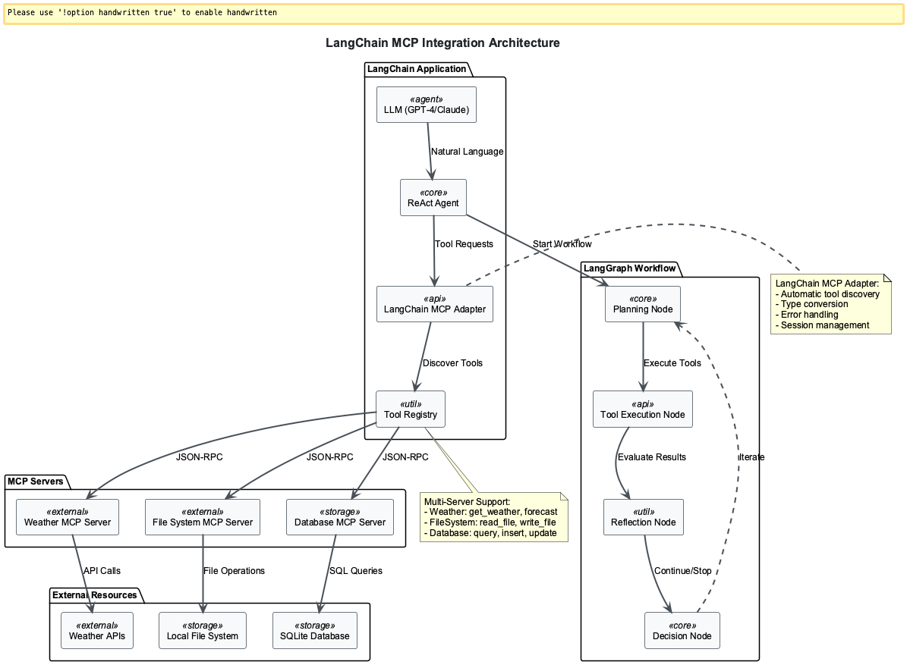

# Session 3: LangChain MCP Integration

## Learning Outcomes

By the end of this session, you will be able to:
- Integrate multiple MCP servers with LangChain to create powerful multi-tool agents
- Build ReAct agents that can reason about and use various tools dynamically
- Implement robust error handling and fallback strategies for production agents
- Design complex workflows using LangGraph for multi-step agent tasks
- Create conversational agents that maintain context across multiple tool interactions

## Chapter Overview

**What you'll learn**: How to bridge MCP servers with LangChain's agent framework to build intelligent multi-tool AI agents that can reason about tool selection and execute complex workflows.

**Why it matters**: LangChain MCP integration solves the enterprise challenge of connecting AI agents to real-world business systems. Instead of maintaining separate connectors for each data source, you get a standardized protocol that scales. Major companies like Block have integrated MCP into their internal tooling, and OpenAI officially adopted MCP across their products in March 2025.

**How it stands out**: Unlike traditional API integrations, MCP provides dynamic tool discovery, real-time bi-directional communication, and enterprise-grade security with OAuth 2.0. The combination with LangChain offers sophisticated orchestration capabilities while maintaining the flexibility to work with hundreds of existing MCP tool servers.

**Where you'll apply it**: Enterprise workflow automation, customer service systems, multi-system integration, and any scenario requiring AI agents to coordinate multiple external tools while maintaining conversation context and handling failures gracefully.


*Figure 1: LangChain agents seamlessly integrate with multiple MCP servers, providing a unified interface for complex reasoning and tool execution workflows*

### Learning Path Options

**Observer Path (35 minutes)**: Understand MCP-LangChain integration concepts with simple examples
- Focus: Clear explanations of ReAct patterns and basic multi-tool coordination
- Best for: Grasping the integration architecture and seeing practical demonstrations

**Participant Path (60 minutes)**: Build functional multi-tool agents and workflows
- Focus: Hands-on implementation of ReAct agents and LangGraph workflows
- Best for: Learning through guided development of production-ready components

**Implementer Path (90 minutes)**: Master enterprise patterns and advanced optimization
- Focus: Production deployment, advanced error handling, and custom workflow orchestration
- Best for: Deep technical expertise in large-scale agent architectures

---

## Part 1: Understanding LangChain MCP Integration (Observer: 8 min | Participant: 15 min)

### The Enterprise Integration Challenge

Traditional AI agent development faces a critical gap: connecting agents to real-world business systems. Consider a customer service scenario where an agent needs to:

- Check weather for shipping delays
- Access customer files for account history  
- Query databases for order status
- Maintain conversation context across all interactions

Without standardization, each integration requires custom code, creating maintenance nightmares as systems scale.

### How LangChain MCP Integration Solves This

The combination of LangChain and MCP creates a best-of-both-worlds solution:

**LangChain provides**: High-level orchestration, workflow management, conversation memory, and sophisticated agent reasoning patterns

**MCP standardizes**: Tool discovery, secure communication, and universal access protocols across different systems

This integration enables you to build AI workflows that seamlessly integrate with any MCP-compatible tool while leveraging LangChain's advanced features like memory, callbacks, and chain composition.

### Simple Integration Example

Let's see how easily LangChain connects to MCP servers:

```python
# Basic MCP-LangChain integration
from langchain_mcp_adapters import MultiServerMCPClient
from langchain.agents import create_react_agent
from langchain_openai import ChatOpenAI

# Connect to multiple MCP servers
client = MultiServerMCPClient({
    "weather": {"command": "python", "args": ["weather_server.py"]},
    "files": {"command": "python", "args": ["file_server.py"]}
})

# Get tools from all servers
tools = client.list_tools()

# Create intelligent agent
agent = create_react_agent(
    llm=ChatOpenAI(model="gpt-4"),
    tools=tools,
    prompt="You are a helpful assistant with access to multiple tools."
)
```

**Key concepts demonstrated:**
- **Multi-server connection**: One client manages multiple MCP servers
- **Automatic tool discovery**: Tools are dynamically loaded from servers
- **ReAct pattern**: Agent reasons about which tools to use
- **Unified interface**: LangChain treats all MCP tools equally

### **PARTICIPANT PATH**: Environment Setup

For hands-on implementation, set up your development environment:

```bash
# Create project directory
mkdir langchain-mcp-integration
cd langchain-mcp-integration

# Create virtual environment
python -m venv venv
source venv/bin/activate  # On Windows: venv\Scripts\activate

# Install core dependencies
pip install langchain-mcp-adapters langgraph langchain-openai \
            langchain-anthropic python-dotenv colorama rich
```

**Dependencies explained:**
- `langchain-mcp-adapters`: Official LangChain integration for MCP servers
- `langgraph`: Advanced workflow and graph-based agent execution
- `langchain-openai/anthropic`: LLM providers for our agents
- `rich`: Enhanced console output for better debugging

### **PARTICIPANT PATH**: Project Structure

Organize your implementation into logical modules for enterprise maintainability:

```
langchain-mcp-integration/
├── mcp_servers/           # MCP server implementations
│   ├── weather_server.py
│   ├── filesystem_server.py
│   └── database_server.py
├── agents/                # Agent implementations
│   ├── basic_agent.py     # Single-tool demonstration
│   ├── multi_tool_agent.py # Multi-server ReAct agent
│   └── workflow_agent.py  # LangGraph workflow agent
├── workflows/             # LangGraph workflow definitions
│   ├── research_workflow.py
│   └── data_analysis_workflow.py
├── utils/                 # Utility functions
│   ├── mcp_manager.py     # MCP server management
│   └── logging_config.py  # Structured logging
├── config.py              # Configuration management
├── main.py               # Main application entry point
└── .env                  # Environment variables
```

**Enterprise organization benefits:**
- **Separation of concerns**: Each module has a specific responsibility
- **Scalability**: Add new agents or servers without restructuring
- **Team collaboration**: Clear boundaries for different development teams
- **Reusability**: Components work independently and can be imported anywhere

### **PARTICIPANT PATH**: Configuration Management

Create a robust configuration system for enterprise deployments:

```python
# config.py - Foundation
import os
from typing import Dict, Any, List
from dataclasses import dataclass
from dotenv import load_dotenv

load_dotenv()

@dataclass
class MCPServerConfig:
    """Configuration for a single MCP server."""
    name: str
    command: str
    args: List[str]
    transport: str = "stdio"
    description: str = ""
    timeout: int = 30
    retry_attempts: int = 3

@dataclass 
class LLMConfig:
    """Configuration for language models."""
    provider: str = "openai"
    model: str = "gpt-4"
    temperature: float = 0.7
    max_tokens: int = 2000
    timeout: int = 60
```

**Configuration design benefits:**
- **Type safety**: Dataclasses provide compile-time type checking
- **Default values**: Sensible defaults reduce configuration complexity
- **Immutability**: Prevents accidental runtime configuration changes
- **IDE support**: Full autocomplete and error detection

```python
# Main configuration class
class Config:
    """Main configuration class for LangChain MCP integration."""
    
    # API Keys from environment variables
    OPENAI_API_KEY = os.getenv("OPENAI_API_KEY")
    ANTHROPIC_API_KEY = os.getenv("ANTHROPIC_API_KEY")
    
    # LLM Configuration with environment overrides
    LLM = LLMConfig(
        provider=os.getenv("LLM_PROVIDER", "openai"),
        model=os.getenv("LLM_MODEL", "gpt-4"),
        temperature=float(os.getenv("LLM_TEMPERATURE", "0.7")),
    )
```

```python
    # MCP Server Registry
    MCP_SERVERS = [
        MCPServerConfig(
            name="weather",
            command="python",
            args=["mcp_servers/weather_server.py"],
            description="Weather information and forecasts"
        ),
        MCPServerConfig(
            name="filesystem", 
            command="python",
            args=["mcp_servers/filesystem_server.py"],
            description="Secure file system operations"
        ),
        MCPServerConfig(
            name="database",
            command="python", 
            args=["mcp_servers/database_server.py"],
            description="Database query and manipulation"
        )
    ]
```

```python
    # Agent Configuration
    AGENT_CONFIG = {
        "max_iterations": int(os.getenv("MAX_ITERATIONS", "10")),
        "verbose": os.getenv("VERBOSE", "true").lower() == "true",
        "temperature": float(os.getenv("AGENT_TEMPERATURE", "0.7")),
        "timeout": int(os.getenv("AGENT_TIMEOUT", "300"))  # 5 minutes
    }
    
    # Logging Configuration
    LOG_LEVEL = os.getenv("LOG_LEVEL", "INFO")
    LOG_FORMAT = "%(asctime)s - %(name)s - %(levelname)s - %(message)s"
```

**Enterprise configuration practices:**
- **Environment-based**: Different settings for dev/staging/production
- **Type safety**: Prevents runtime configuration errors
- **Timeout controls**: Prevents hanging processes in production
- **Structured logging**: Essential for debugging distributed agent workflows

### **IMPLEMENTER PATH**: Advanced Configuration

*See optional modules below for enterprise-level configuration patterns*

---

## Part 2: Building Your First Multi-Tool Agent (Observer: 10 min | Participant: 20 min)

### Understanding Multi-Server Coordination

Real enterprise AI agents need to coordinate multiple tools intelligently. Consider this customer service scenario:

```python
# Customer inquiry: "What's the weather like for my shipment to London?"
# Agent needs to:
# 1. Query customer database for shipment details
# 2. Get weather data for London
# 3. Check file system for shipping policies
# 4. Combine information into helpful response
```

This requires an agent that can:
- **Reason about tool selection**: Which tools are relevant to the query?
- **Handle tool failures**: What if the weather service is down?
- **Maintain context**: Remember previous conversation details
- **Coordinate execution**: Use tools in logical sequence

### **PARTICIPANT PATH**: MCP Server Management

Build a robust system to manage multiple MCP servers:

```python
# utils/mcp_manager.py - Foundation
import asyncio
import logging
from typing import Dict, List, Optional
from langchain_mcp_adapters import MCPAdapter
from config import Config, MCPServerConfig

logger = logging.getLogger(__name__)

class MCPServerManager:
    """Manages multiple MCP servers with health monitoring."""
    
    def __init__(self, server_configs: List[MCPServerConfig]):
        self.server_configs = {config.name: config for config in server_configs}
        self.adapters: Dict[str, MCPAdapter] = {}
        self.health_status: Dict[str, bool] = {}
```

**Key design decisions:**
- **Dictionary lookups**: Fast O(1) server access by name
- **Health tracking**: Know which servers are operational in real-time
- **Separation of concerns**: Configuration vs. runtime state

```python
    async def start_all_servers(self) -> Dict[str, bool]:
        """Start all configured MCP servers."""
        results = {}
        
        for name, config in self.server_configs.items():
            result = await self._start_single_server(name, config)
            results[name] = result
        
        return results
    
    async def _start_single_server(self, name: str, config: MCPServerConfig) -> bool:
        """Start a single MCP server and test its connection."""
        try:
            logger.info(f"Starting MCP server: {name}")
            adapter = MCPAdapter(
                command=config.command,
                args=config.args,
                timeout=config.timeout
            )
            
            # Test connection and discover tools
            await adapter.start()
            tools = await adapter.list_tools()
            
            # Store adapter and update status
            self.adapters[name] = adapter
            self.health_status[name] = True
            
            logger.info(f"Server '{name}' started with {len(tools)} tools")
            return True
            
        except Exception as e:
            logger.error(f"Failed to start server '{name}': {e}")
            self.health_status[name] = False
            return False
```


```python
    async def get_adapter(self, server_name: str) -> Optional[MCPAdapter]:
        """Get adapter with automatic health checking."""
        if server_name not in self.adapters:
            logger.warning(f"Server '{server_name}' not found")
            return None
        
        if not self.health_status.get(server_name, False):
            logger.warning(f"Server '{server_name}' is unhealthy")
            # Attempt automatic restart
            await self._restart_server(server_name)
        
        return self.adapters.get(server_name)
    
    async def _restart_server(self, name: str):
        """Attempt to restart a failed server."""
        config = self.server_configs.get(name)
        if config:
            await self._start_single_server(name, config)
```

**Production features:**
- **Health monitoring**: Continuous checks with automatic restart
- **Error recovery**: Graceful handling of server failures  
- **Resource management**: Proper cleanup prevents memory leaks
- **Observability**: Comprehensive logging for debugging

### **IMPLEMENTER PATH**: Advanced Server Management

*See optional modules below for enterprise patterns including continuous health monitoring, connection pooling, and distributed server deployment*

### Simple ReAct Agent Pattern

Now let's see how LangChain agents use the ReAct (Reasoning and Acting) pattern to coordinate multiple tools:

```python
# Basic ReAct agent with MCP tools
from langchain.agents import create_react_agent, AgentExecutor
from langchain_core.prompts import PromptTemplate
from langchain_openai import ChatOpenAI

# Simple ReAct prompt template
react_prompt = PromptTemplate.from_template("""
You have access to multiple tools. Use this format:

Question: {input}
Thought: I need to think about which tools to use
Action: [tool_name]
Action Input: [input_for_tool]
Observation: [result_from_tool]
... (repeat Thought/Action as needed)
Thought: I now have enough information
Final Answer: [comprehensive_response]

Available tools: {tools}
Question: {input}
{agent_scratchpad}
""")
```

**ReAct pattern benefits:**
- **Transparent reasoning**: See how the agent thinks through problems
- **Iterative improvement**: Agent can use tool results to inform next actions
- **Error recovery**: Can try different tools if first attempts fail
- **Context building**: Each step builds on previous observations

### **PARTICIPANT PATH**: MCP Server Implementation

Create lightweight MCP servers for your agent integration:

```python
# mcp_servers/weather_server.py
from mcp.server.fastmcp import FastMCP
from datetime import datetime
from typing import Dict

mcp = FastMCP("Weather Server")

# Sample weather data
WEATHER_DATA = {
    "London": {"temp": 15, "condition": "Cloudy", "humidity": 75},
    "New York": {"temp": 22, "condition": "Sunny", "humidity": 60},
    "Tokyo": {"temp": 18, "condition": "Rainy", "humidity": 85},
}

@mcp.tool()
def get_current_weather(city: str, units: str = "celsius") -> Dict:
    """Get current weather for a city."""
    if city not in WEATHER_DATA:
        return {"error": f"Weather data not available for {city}"}
    
    data = WEATHER_DATA[city].copy()
    if units == "fahrenheit":
        data["temp"] = (data["temp"] * 9/5) + 32
        data["units"] = "°F"
    else:
        data["units"] = "°C"
    
    data["city"] = city
    data["timestamp"] = datetime.now().isoformat()
    return data

if __name__ == "__main__":
    mcp.run()
```


**Design principles:**
- **Simple data structure**: Easy to understand and extend
- **Error handling**: Graceful responses for invalid inputs
- **Unit conversion**: Support different temperature scales
- **Realistic simulation**: Demonstrates real-world patterns

---

## Part 3: Advanced Multi-Tool Coordination (Observer: 12 min | Participant: 25 min)

### Understanding Agent Tool Selection

Intelligent agents must decide which tools to use based on user queries. Here's how LangChain agents make these decisions:

**Query Analysis Process:**
1. **Parse user intent**: What is the user trying to accomplish?
2. **Identify relevant tools**: Which tools can help with this task?
3. **Plan execution order**: What sequence makes sense?
4. **Handle failures**: What if a tool doesn't work?

**Example Decision Tree:**
```
User: "What's the weather in London and do I have any files about UK shipping?"

Agent reasoning:
- Weather query → Use weather tool
- File search → Use filesystem tool  
- Coordination → Use both tools, then synthesize results
```

### **PARTICIPANT PATH**: Building Single-Tool Agent

Start with a simple agent to understand the integration pattern:

```python
# agents/basic_agent.py
import asyncio
import logging
from typing import Optional
from langchain.agents import create_react_agent, AgentExecutor
from langchain_core.prompts import PromptTemplate
from langchain_openai import ChatOpenAI
from langchain_core.tools import Tool

from utils.mcp_manager import MCPServerManager
from config import Config

logger = logging.getLogger(__name__)

class BasicMCPAgent:
    """A basic ReAct agent using a single MCP server."""
    
    def __init__(self, server_name: str, mcp_manager: MCPServerManager):
        self.server_name = server_name
        self.mcp_manager = mcp_manager
        self.llm = None
        self.agent_executor = None
```

```python
    async def initialize(self) -> bool:
        """Initialize the agent with LLM and tools."""
        try:
            # Initialize LLM
            self.llm = ChatOpenAI(
                model=Config.LLM.model,
                temperature=Config.LLM.temperature,
                api_key=Config.OPENAI_API_KEY
            )
            
            # Get MCP adapter and tools
            adapter = await self.mcp_manager.get_adapter(self.server_name)
            if not adapter:
                logger.error(f"Failed to get adapter: {self.server_name}")
                return False
            
            # Convert MCP tools to LangChain tools
            mcp_tools = await adapter.list_tools()
            langchain_tools = self._create_langchain_tools(mcp_tools, adapter)
            
            # Create the agent executor
            self.agent_executor = self._create_agent_executor(langchain_tools)
            
            logger.info(f"Agent initialized with {len(langchain_tools)} tools")
            return True
            
        except Exception as e:
            logger.error(f"Failed to initialize agent: {e}")
            return False
```

```python
    def _create_langchain_tools(self, mcp_tools, adapter):
        """Convert MCP tools to LangChain tools."""
        langchain_tools = []
        
        for mcp_tool in mcp_tools:
            # Create wrapper for MCP tool
            async def tool_wrapper(tool_input: str, tool_name=mcp_tool.name):
                """Wrapper to call MCP tool from LangChain."""
                try:
                    result = await adapter.call_tool(tool_name, {"input": tool_input})
                    return str(result)
                except Exception as e:
                    return f"Error calling tool {tool_name}: {str(e)}"
            
            langchain_tool = Tool(
                name=mcp_tool.name,
                description=mcp_tool.description or f"Tool from {self.server_name}",
                func=lambda x, tn=mcp_tool.name: asyncio.create_task(tool_wrapper(x, tn))
            )
            langchain_tools.append(langchain_tool)
        
        return langchain_tools
    
    async def run(self, query: str) -> str:
        """Run the agent with a query."""
        if not self.agent_executor:
            return "Agent not initialized. Call initialize() first."
        
        try:
            result = await self.agent_executor.ainvoke({"input": query})
            return result["output"]
        except Exception as e:
            return f"Error processing request: {str(e)}"
```


**Key integration concepts:**
- **Tool wrapping**: MCP tools become LangChain-compatible
- **Error handling**: Graceful degradation when tools fail
- **Async support**: Non-blocking execution for better performance
- **ReAct pattern**: Transparent reasoning process


### Enterprise Multi-Tool Coordination

Real-world enterprise agents coordinate multiple tools to solve complex problems. Consider this customer service workflow:

**Scenario**: "Check my order status for shipment to London, considering weather delays"

**Agent Coordination Process**:
1. **Parse request**: Extract order ID and destination
2. **Query database**: Get order and shipping details  
3. **Check weather**: Get current conditions for London
4. **Access policies**: Find relevant shipping policy documents
5. **Synthesize response**: Combine all information into helpful answer

This requires sophisticated reasoning about:
- **Tool dependencies**: Database query must happen before weather check
- **Error recovery**: What if database is down but weather works?
- **Context management**: Remember order details across tool calls
- **Information synthesis**: Combine disparate data sources meaningfully

### **PARTICIPANT PATH**: Advanced Multi-Tool Agent

Build an agent that intelligently coordinates multiple MCP servers:

```python
# agents/multi_tool_agent.py
import asyncio
import logging
from typing import Dict, List, Any, Optional
from langchain.agents import create_react_agent, AgentExecutor
from langchain_core.prompts import PromptTemplate
from langchain_openai import ChatOpenAI
from langchain_core.tools import Tool
from langchain.memory import ConversationBufferWindowMemory

from utils.mcp_manager import MCPServerManager
from config import Config

logger = logging.getLogger(__name__)

class MultiToolMCPAgent:
    """Advanced ReAct agent using multiple MCP servers."""
    
    def __init__(self, mcp_manager: MCPServerManager):
        self.mcp_manager = mcp_manager
        self.llm = None
        self.agent_executor = None
        self.memory = None
        self.available_tools = {}
```

```python
    async def initialize(self) -> bool:
        """Initialize agent with LLM, tools, and memory."""
        try:
            # Initialize LLM
            self.llm = ChatOpenAI(
                model=Config.LLM.model,
                temperature=Config.LLM.temperature,
                api_key=Config.OPENAI_API_KEY
            )
            
            # Initialize conversation memory
            self.memory = ConversationBufferWindowMemory(
                k=10,  # Remember last 10 exchanges
                memory_key="chat_history",
                return_messages=True
            )
            
            # Collect tools from all available servers
            langchain_tools = await self._collect_all_tools()
            
            if not langchain_tools:
                logger.error("No tools available from MCP servers")
                return False
            
            # Create enhanced agent executor
            self.agent_executor = self._create_enhanced_agent(langchain_tools)
            
            tool_count = len(langchain_tools)
            server_count = len(self.available_tools)
            logger.info(f"Multi-tool agent: {tool_count} tools from {server_count} servers")
            
            return True
            
        except Exception as e:
            logger.error(f"Failed to initialize multi-tool agent: {e}")
            return False
```

```python
    def _create_enhanced_agent(self, langchain_tools):
        """Create enhanced ReAct agent with intelligent prompting."""
        react_prompt = PromptTemplate.from_template("""
You are an intelligent AI assistant with access to multiple specialized tools.
You can use weather information, file system operations, and database queries.

INSTRUCTIONS:
1. Analyze the user's request carefully
2. Identify which tools might be helpful
3. Use tools in logical sequence
4. Provide comprehensive, helpful responses
5. If a tool fails, try alternative approaches

Available tools: {tools}

Use this format:
Question: {input}
Thought: Let me analyze what tools I need
Action: [tool_name]
Action Input: [input_for_tool]
Observation: [result_from_tool]
... (repeat as needed)
Thought: I have enough information
Final Answer: [comprehensive_response]

Conversation history: {chat_history}
Question: {input}
{agent_scratchpad}
""")
        
        agent = create_react_agent(
            llm=self.llm,
            tools=langchain_tools,
            prompt=react_prompt
        )
        
        return AgentExecutor(
            agent=agent,
            tools=langchain_tools,
            memory=self.memory,
            verbose=Config.AGENT_CONFIG["verbose"],
            max_iterations=Config.AGENT_CONFIG["max_iterations"],
            handle_parsing_errors=True,
            return_intermediate_steps=True
        )
```


**Enhanced prompting benefits:**
- **Clear instructions**: Step-by-step guidance for intelligent tool usage
- **Context awareness**: Includes conversation history for better responses
- **Error recovery**: Instructions for handling tool failures gracefully
- **Structured reasoning**: ReAct format ensures transparent thinking

**Key advances over basic agents:**
- **Multi-server support**: Uses tools from all available MCP servers
- **Conversation memory**: Maintains context across interactions
- **Enhanced prompting**: Better instructions for intelligent tool selection
- **Error recovery**: Graceful handling of server failures

### **IMPLEMENTER PATH**: Production Agent Patterns

*See optional modules below for enterprise-level agent architectures including distributed tool coordination, advanced error recovery, and performance optimization*

---

## Part 4: Orchestrating Complex Workflows (Observer: 5 min | Participant: 20 min)

### Understanding Workflow Orchestration

Complex enterprise tasks require orchestrated workflows that coordinate multiple tools systematically. Traditional agents make decisions step-by-step, but workflows can:

- **Plan ahead**: Define the entire process upfront
- **Parallel execution**: Run multiple tools simultaneously when possible  
- **State management**: Track data as it flows between tools
- **Error handling**: Recover from failures without losing progress

**Enterprise Example**: Customer onboarding workflow
1. **Validate information** → Check customer data in database
2. **Generate documents** → Create account files
3. **Send notifications** → Email welcome materials
4. **Schedule followup** → Add to calendar system

Each step depends on previous ones but can be designed for optimal efficiency.

### **PARTICIPANT PATH**: LangGraph Research Workflow

Build a sophisticated research workflow using LangGraph:

```python
# workflows/research_workflow.py
import asyncio
from typing import Dict, Any, List
from langchain_core.messages import HumanMessage, AIMessage
from langgraph.graph import StateGraph, END
from dataclasses import dataclass

from utils.mcp_manager import MCPServerManager
from config import Config

@dataclass
class ResearchState:
    """State tracking data through workflow steps."""
    query: str
    messages: List[Any] 
    research_plan: str = ""
    weather_data: Dict = None
    file_data: Dict = None
    database_data: Dict = None
    final_report: str = ""
    step_count: int = 0
```

**State design benefits:**
- **Type safety**: Dataclass provides compile-time checking
- **State persistence**: Each node can access and modify shared state
- **Clear data flow**: Separate fields for each research domain
- **Progress tracking**: Monitor workflow execution progress

```python
class ResearchWorkflow:
    """Advanced research workflow using LangGraph and multiple MCP servers."""
    
    def __init__(self, mcp_manager: MCPServerManager):
        self.mcp_manager = mcp_manager
        self.workflow = None
    
    async def build_workflow(self) -> StateGraph:
        """Build the LangGraph workflow graph."""
        workflow = StateGraph(ResearchState)
        
        # Add processing nodes
        workflow.add_node("planner", self._planning_node)
        workflow.add_node("weather_researcher", self._weather_research_node)
        workflow.add_node("file_researcher", self._file_research_node)
        workflow.add_node("database_researcher", self._database_research_node)
        workflow.add_node("synthesizer", self._synthesis_node)
        
        # Define execution flow
        workflow.set_entry_point("planner")
        workflow.add_edge("planner", "weather_researcher")
        workflow.add_edge("weather_researcher", "file_researcher")
        workflow.add_edge("file_researcher", "database_researcher")
        workflow.add_edge("database_researcher", "synthesizer")
        workflow.add_edge("synthesizer", END)
        
        self.workflow = workflow.compile()
        return self.workflow
```


**Workflow design principles:**
- **Sequential processing**: Each step builds on previous results
- **Modular nodes**: Each research domain has dedicated processing
- **Clear flow**: Linear progression from planning to synthesis
- **Compiled execution**: Optimized for performance

```python
    async def _planning_node(self, state: ResearchState) -> ResearchState:
        """Plan research approach based on query analysis."""
        query_lower = state.query.lower()
        plan_elements = []
        
        # Analyze query for different research domains
        if any(word in query_lower for word in ["weather", "climate", "temperature"]):
            plan_elements.append("- Gather weather information")
        
        if any(word in query_lower for word in ["file", "document", "data"]):
            plan_elements.append("- Search relevant files")
        
        if any(word in query_lower for word in ["database", "record", "history"]):
            plan_elements.append("- Query database for information")
        
        # Build research plan
        state.research_plan = "Research Plan:\n" + "\n".join(plan_elements) if plan_elements else "General research"
        state.step_count += 1
        return state
```

**Planning benefits:**
- **Keyword analysis**: Determines relevant tools automatically
- **Dynamic adaptation**: Responds to different query types
- **Transparency**: Creates clear plan documentation
- **Extensibility**: Easy to add new research domains

```python
    async def _weather_research_node(self, state: ResearchState) -> ResearchState:
        """Research weather information if relevant."""
        if "weather" not in state.query.lower():
            state.weather_data = {"skipped": True}
            return state
        
        try:
            adapter = await self.mcp_manager.get_adapter("weather")
            if adapter:
                cities = self._extract_cities_from_query(state.query)
                weather_results = {}
                
                for city in cities:
                    try:
                        result = await adapter.call_tool("get_current_weather", {"city": city})
                        weather_results[city] = result
                    except:
                        continue  # Try other cities
                
                state.weather_data = weather_results or {"error": "No weather data"}
            else:
                state.weather_data = {"error": "Weather server unavailable"}
        
        except Exception as e:
            state.weather_data = {"error": str(e)}
        
        state.step_count += 1
        return state
    
    async def run_research(self, query: str) -> Dict[str, Any]:
        """Execute the complete research workflow."""
        if not self.workflow:
            await self.build_workflow()
        
        initial_state = ResearchState(query=query, messages=[HumanMessage(content=query)])
        
        try:
            final_state = await self.workflow.ainvoke(initial_state)
            return {
                "success": True,
                "query": query,
                "report": final_state.final_report,
                "steps": final_state.step_count
            }
        except Exception as e:
            return {
                "success": False,
                "query": query,
                "error": str(e),
                "report": f"Research workflow failed: {str(e)}"
            }
```


**LangGraph workflow advantages:**
- **State management**: Track data flow between processing nodes
- **Error isolation**: Individual node failures don't crash entire workflow
- **Parallel execution**: Run independent research tasks simultaneously
- **Visual debugging**: See exactly where workflows succeed or fail

### **IMPLEMENTER PATH**: Production Workflows

*See optional modules below for enterprise workflow patterns including parallel execution, conditional branching, and distributed processing*

---

## Chapter Summary

You've mastered LangChain MCP integration and built sophisticated multi-tool AI agents.

### Key Concepts Mastered:

1. **MCP-LangChain Integration**: Seamlessly connected multiple MCP servers with LangChain agents
2. **ReAct Agent Patterns**: Built intelligent agents that reason about tool selection and execution
3. **Multi-Tool Coordination**: Created agents that coordinate multiple external systems intelligently
4. **Workflow Orchestration**: Implemented complex stateful workflows using LangGraph
5. **Enterprise Architecture**: Designed production-ready systems with health monitoring and error recovery

### Your Enhanced Agent Capabilities:

- **Multi-tool reasoning**: Intelligently select and coordinate multiple tools
- **Context preservation**: Maintain conversation memory across tool interactions
- **Graceful failure handling**: Automatic recovery when tools fail
- **Workflow orchestration**: Execute complex multi-step processes
- **Enterprise readiness**: Production-grade error handling and monitoring

### Production Benefits:

- **Standardization**: Universal protocol for connecting AI agents to business systems
- **Scalability**: Easy integration of new tools and services
- **Reliability**: Health monitoring and automatic recovery
- **Security**: Enterprise-grade OAuth 2.0 authentication and access controls

---

## Additional Resources

- [LangChain MCP Adapters GitHub](https://github.com/langchain-ai/langchain-mcp-adapters) - Official integration library
- [LangGraph Documentation](https://langchain-ai.github.io/langgraph/) - Workflow orchestration guide
- [Model Context Protocol](https://modelcontextprotocol.io/) - Official MCP specification
- [ReAct Paper](https://arxiv.org/abs/2210.03629) - Original research on reasoning and acting patterns

---

## 💡 Practical Exercise

**Challenge:** Create a travel planning agent that gets weather, searches files, stores preferences, and creates a report.

Build an intelligent travel planning agent that demonstrates the power of coordinating multiple MCP servers. Your agent should:

### Requirements:
1. **Weather Integration**: Get current weather for destination cities
2. **File Search**: Search existing travel documents and preferences
3. **Preference Storage**: Store user travel preferences (budget, activities, etc.)
4. **Report Generation**: Create a comprehensive travel report

### Implementation Guidelines:

```python
from langchain_mcp import MCPToolkit
from langchain.agents import initialize_agent, AgentType
from langchain.llm import OpenAI

# Your multi-server agent setup
weather_toolkit = MCPToolkit.from_server("weather-server")
file_toolkit = MCPToolkit.from_server("filesystem-server") 
preference_toolkit = MCPToolkit.from_server("preference-server")

# Combine toolkits and create agent
all_tools = weather_toolkit.get_tools() + file_toolkit.get_tools() + preference_toolkit.get_tools()
```

### Expected Functionality:
- Query weather for multiple destinations
- Search for previous travel experiences in files
- Store new preferences based on user input
- Generate a structured travel recommendation

**Hint:** Use the multi-tool agent pattern with enhanced prompting for intelligent tool coordination.

---

## 📝 Multiple Choice Test - Session 3

Test your understanding of LangChain MCP Integration:

**Question 1:** What is the primary advantage of using LangChain MCP adapters?  

A) Better performance  
B) Automatic tool discovery and integration ✅  
C) Reduced memory usage  
D) Simplified configuration  

**Question 2:** In the ReAct pattern, what does the agent do after each Action?  

A) Plan the next action  
B) Wait for user input  
C) Observe the result ✅  
D) Generate a final answer  

**Question 3:** What is the purpose of health monitoring in MCPServerManager?  

A) Improve performance  
B) Automatically restart failed servers ✅  
C) Monitor memory usage  
D) Log user interactions  

**Question 4:** What advantage does LangGraph provide over simple ReAct agents?  

A) Faster execution  
B) Complex stateful workflows ✅  
C) Better error handling  
D) Simpler configuration  

**Question 5:** How does our multi-tool agent decide which tools to use?  

A) Random selection  
B) Pre-configured rules  
C) LLM reasoning about tool descriptions ✅  
D) User specification  

**Question 6:** What enterprise benefit does MCP provide over traditional API integrations?  

A) Faster response times  
B) Standardized protocol for tool integration ✅  
C) Lower development costs  
D) Better user interfaces  

**Question 7:** Which companies have adopted MCP in their production systems?  

A) Only startups  
B) Block, OpenAI, and Google DeepMind ✅  
C) Government agencies only  
D) Educational institutions  

**Question 8:** What authentication standard does MCP use for enterprise security?  

A) Basic authentication  
B) API keys only  
C) OAuth 2.0 ✅  
D) Custom tokens  

**Question 9:** In LangGraph workflows, what tracks data between processing nodes?  

A) Global variables  
B) State objects ✅  
C) Database records  
D) Configuration files  

**Question 10:** What happens when an MCP server fails in our architecture?  

A) The entire system crashes  
B) Other servers are affected  
C) Automatic restart is attempted ✅  
D) Manual intervention is required  

[**🗂️ View Test Solutions →**](Session3_Test_Solutions.md)

---

## 🧭 Navigation

**Previous:** [Session 2 - FileSystem MCP Server](Session2_FileSystem_MCP_Server.md)

**Optional Deep-Dive Modules:**
- **[Module A: Enterprise Agent Patterns](Session3_ModuleA_Enterprise_Patterns.md)** - Production deployment, advanced error handling, and performance optimization
- **[Module B: Advanced Workflow Orchestration](Session3_ModuleB_Advanced_Workflows.md)** - Parallel processing, conditional branching, and distributed coordination

**Next:** [Session 4 - Production MCP Deployment](Session4_Production_MCP_Deployment.md)