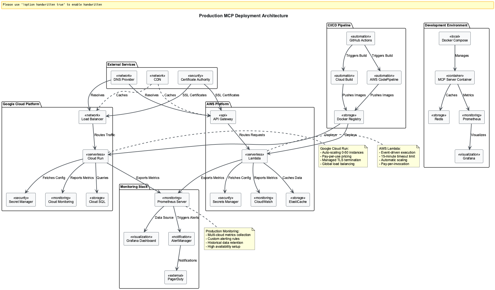

# 🎯📝 Session 4: Production MCP Deployment - From Prototype to Production Reality

## 🎯📝⚙️ Learning Path Overview

This session offers three distinct learning paths designed to match your goals and time investment:

=== "🎯 Observer (45-60 min)"

    **Focus**: Understanding concepts and architecture
    
    **Activities**: Production deployment requirements, infrastructure fundamentals, observability principles
    
    **Ideal for**: Decision makers, architects, overview learners

=== "📝 Participant (3-4 hours)"

    **Focus**: Guided implementation and analysis
    
    **Activities**: Build production infrastructure, containerization, monitoring setup
    
    **Ideal for**: Developers, technical leads, hands-on learners

=== "⚙️ Implementer (8-10 hours)"

    **Focus**: Complete implementation and customization
    
    **Activities**: Enterprise-grade deployment patterns, advanced orchestration, multi-region setup
    
    **Ideal for**: Senior engineers, architects, specialists

---

## 🎯 Observer Path: Understanding Production Fundamentals

### The Great Leap: When Your Creation Meets the Real World

Imagine you've built the perfect MCP server in your development environment. It runs flawlessly on your laptop, handles every test case with grace, and impresses everyone in demos. But now comes the moment of truth - the terrifying and exhilarating leap from the safety of `localhost` to the vast, unforgiving landscape of production.

This isn't just about copying code to a server and hoping for the best. This is about **transformation** - evolving your elegant prototype into a battle-hardened production system that can handle the chaos, scale, and relentless demands of the real world.



### The Reality Check: What Production Actually Means

When developers talk about "production," they often think it means "the place where users access my app." But production is so much more than that - it's a completely different universe with its own laws of physics:

- **Murphy's Law is the governing principle**: Everything that can go wrong, will go wrong, at the worst possible moment  
- **Scale changes everything**: What works for 10 users completely breaks at 10,000 users  
- **Observability becomes survival**: If you can't see what's happening, you can't fix what's broken  
- **Security becomes paramount**: Every endpoint is a potential attack vector  
- **Performance is non-negotiable**: Users expect instant responses, regardless of load  
- **Compliance isn't optional**: Regulations and audit trails become critical business requirements  

---

## 📝 Participant Path: Building Production Infrastructure

*Prerequisites: Complete Observer Path sections above*

### Part 1: Production Infrastructure Fundamentals

### The Six Pillars of Production Excellence

Building production-ready MCP servers means mastering six fundamental pillars that separate hobby projects from enterprise systems:

#### 1. **Observability**: Your Digital Nervous System

Without comprehensive observability, you're flying blind in production. Every request, every error, every performance hiccup needs to be captured, analyzed, and acted upon.

#### 2. **Scalability**: Growing Without Breaking

Your system must gracefully handle 10x, 100x, or 1000x more load than you initially planned for - and do it automatically.

#### 3. **Reliability**: The Foundation of Trust

Fault tolerance, circuit breakers, and graceful degradation aren't luxury features - they're survival mechanisms.

#### 4. **Security**: Your Defense Against the Dark Arts

Every production system is under constant attack. Your security posture determines whether you're a fortress or a glass house.

#### 5. **Performance**: Speed as a Feature

In production, performance isn't just about user experience - it's about operational costs and system stability.

#### 6. **Compliance**: Playing by the Rules

Audit trails, data protection, and regulatory compliance aren't just checkboxes - they're business imperatives.

### Building Your Production-Ready Foundation

Let's start by transforming your MCP server into a production-grade service. This isn't just about adding a few configuration options - it's about architecting for survival in the production wilderness.

First, we set up the essential imports for our production system:

```python
# src/production_mcp_server.py - Your Production War Machine
import os
import json
import structlog
from datetime import datetime
from typing import Dict, Any, Optional
from mcp.server.fastmcp import FastMCP
```

Next, we add the production-critical dependencies:

```python
# Production dependencies for monitoring and resilience
import aioredis
import asyncio
from prometheus_client import Counter, Histogram, Gauge
from tenacity import retry, stop_after_attempt, wait_exponential
import time
```

### The Technology Stack That Powers Production

Each dependency here represents a crucial weapon in your production arsenal:

- **`structlog`**: Structured logging that makes debugging in production actually possible
- **`prometheus_client`**: The industry standard for metrics collection and monitoring
- **`tenacity`**: Intelligent retry policies that handle the inevitable failures gracefully
- **`aioredis`**: High-performance caching that can make or break your performance SLAs

### Structured Logging: Your Production Lifeline

In development, you can get away with `print()` statements and basic logging. In production, structured logging isn't just nice to have - it's your lifeline when things go wrong at 3 AM.

Here's how to configure enterprise-grade structured logging:

```python
# Configure structured logging processors
structlog.configure(
    processors=[
        structlog.stdlib.filter_by_level,
        structlog.stdlib.add_logger_name,
        structlog.stdlib.add_log_level,
        structlog.processors.TimeStamper(fmt="iso"),
        structlog.processors.JSONRenderer()
    ],
    context_class=dict,
    logger_factory=structlog.stdlib.LoggerFactory(),
    cache_logger_on_first_use=True,
)
```

This configuration creates the foundation for debugging production issues:

```python
# Initialize the production logger
logger = structlog.get_logger()
```

### Why This Logging Configuration Matters

This isn't just configuration - it's your insurance policy for production operations:

- **JSON format**: Essential for log aggregation systems like ELK Stack or Splunk  
- **Structured fields**: Enables automated analysis and alerting  
- **ISO timestamps**: Critical for distributed systems where timing matters  
- **Automatic exception handling**: Captures stack traces without breaking the flow  

### Prometheus Metrics: Your Production Dashboard

Metrics are the vital signs of your production system. Without them, you're diagnosing a patient with no pulse monitor, no blood pressure cuff, and no thermometer.

First, we define request metrics - the heartbeat of your service:

```python
# Request metrics - The heartbeat of your service
request_count = Counter(
    'mcp_requests_total',
    'Total MCP requests processed',
    ['method', 'status', 'client_id', 'version']
)
```

Next, we add timing metrics with carefully chosen buckets:

```python
# Request timing with production-tuned buckets
request_duration = Histogram(
    'mcp_request_duration_seconds',
    'MCP request processing time',
    ['method', 'endpoint'],
    buckets=(0.005, 0.01, 0.025, 0.05, 0.1, 0.25, 0.5, 1.0, 2.5, 5.0, 10.0)
)
```

System health metrics provide infrastructure monitoring:

```python
# System health metrics - Your infrastructure monitoring
active_connections = Gauge('mcp_active_connections', 'Current active connections')
cpu_usage = Gauge('mcp_cpu_usage_percent', 'CPU utilization percentage')
memory_usage = Gauge('mcp_memory_usage_bytes', 'Memory consumption in bytes')
```

Business metrics help understand user behavior:

```python
# Business metrics - Understanding your users
tool_usage = Counter('mcp_tool_usage_total', 'Tool execution counts', ['tool_name', 'success'])
cache_hits = Counter('mcp_cache_hits_total', 'Cache performance metrics', ['type'])
```

Finally, we start the metrics server:

```python
# Start Prometheus metrics endpoint
from prometheus_client import start_http_server
start_http_server(9090)  # Accessible at :9090/metrics
logger.info("Prometheus metrics server started", port=9090)
```

### Understanding Your Metrics Categories

These aren't just random numbers - each category serves a specific purpose in production operations:

- **SLI Metrics (Service Level Indicators)**: Request rate, latency, error rate - the holy trinity of service health  
- **Resource Metrics**: CPU, memory, connections - your early warning system for capacity issues  
- **Business Metrics**: Tool usage patterns - understanding how your service is actually used  
- **Security Metrics**: Rate limiting, abuse detection - your defense against malicious actors  

### Health Checks: The Heartbeat of Production

In production, "is it running?" isn't enough. You need to know "is it ready to serve traffic?" and "is it healthy enough to stay in the load balancer pool?"

The basic liveness probe answers: "Is the service alive?"

```python
@app.route('/health')
async def health_check():
    """Kubernetes liveness probe - The fundamental question: Is the service alive?"""
    return {
        "status": "healthy",
        "timestamp": datetime.utcnow().isoformat()
    }
```

The readiness probe is more sophisticated - it checks dependencies:

```python
@app.route('/ready')
async def readiness_check():
    """Kubernetes readiness probe - The critical question: Can we serve traffic?"""
    checks = {
        "redis": await check_redis_connection(),
        "mcp_servers": await check_mcp_servers(),
        "disk_space": check_disk_space(),
    }
```

The readiness check evaluates all dependencies and returns appropriate status:

```python
    # Evaluate overall health and return appropriate status
    all_healthy = all(checks.values())
    status_code = 200 if all_healthy else 503

    return {
        "status": "ready" if all_healthy else "not_ready",
        "checks": checks,
        "timestamp": datetime.utcnow().isoformat()
    }, status_code
```

### Basic Production Server Structure

Now let's build the foundation of a production server class. This demonstrates the essential patterns you need for production deployment.

We start by defining the class structure and its core mission:

```python
class ProductionMCPServer:
    """
    The Production Transformation: From Development Toy to Enterprise Tool

    This server embodies everything you need for production deployment:
    - Redis caching for blazing performance under load
    - Prometheus metrics for comprehensive monitoring
    - Health checks for load balancer integration
    """
```

Next, we implement the basic initialization logic:

```python
    def __init__(self, name: str = "Production MCP Server"):
        self.mcp = FastMCP(name)
        self.redis_client: Optional[aioredis.Redis] = None
        self.cache_ttl = int(os.getenv('CACHE_TTL', '300'))  # 5 minutes default
        self.start_time = time.time()
```

Environment-based configuration enables deployment flexibility:

```python
        # Configuration from environment - The key to deployment flexibility
        self.config = {
            'redis_url': os.getenv('REDIS_URL', 'redis://localhost:6379'),
            'max_request_size': int(os.getenv('MAX_REQUEST_SIZE', '1048576')),
            'rate_limit': int(os.getenv('RATE_LIMIT', '100')),
            'environment': os.getenv('ENVIRONMENT', 'development')
        }
```

### Basic Container Setup

For production deployment, containerization provides consistency and portability. Here's a basic Docker configuration:

```dockerfile
# Basic production Dockerfile
FROM python:3.11-slim

# Install system dependencies
RUN apt-get update && apt-get install -y gcc \
    && rm -rf /var/lib/apt/lists/*

# Security hardening
RUN useradd -m -u 1000 mcpuser
WORKDIR /app
```

Copy dependencies and application code:

```dockerfile
# Dependency installation
COPY requirements.txt .
RUN pip install --no-cache-dir -r requirements.txt

# Application code
COPY src/ ./src/
USER mcpuser
```

Configure the container for production:

```dockerfile
# Health check and startup
HEALTHCHECK --interval=30s --timeout=10s --retries=3 \
  CMD python scripts/health_check.py || exit 1

EXPOSE 9090
CMD ["python", "-m", "src.production_mcp_server"]
```

---

## ⚙️ Implementer Path: Advanced Production Systems

*Prerequisites: Complete Observer and Participant paths above*

For comprehensive production deployment including advanced server architectures, cloud deployment strategies, monitoring systems, and enterprise patterns, continue with these advanced modules:

### Advanced Production Modules

- ⚙️ [Advanced Server Architecture](Session4_Advanced_Server_Architecture.md) - Complete production server implementation with async patterns, caching strategies, and monitoring integration  
- ⚙️ [Cloud Deployment Strategies](Session4_Cloud_Deployment_Strategies.md) - Google Cloud Run and AWS Lambda deployment with Infrastructure as Code  
- ⚙️ [Production Monitoring Systems](Session4_Production_Monitoring_Systems.md) - Comprehensive monitoring, alerting, and observability implementation  
- ⚙️ [Enterprise Resilience Patterns](Session4_Enterprise_Resilience_Patterns.md) - Circuit breakers, chaos engineering, and production resilience testing  

---
## 📝 Practice Exercises

### Exercise 1: Basic Production Setup

Implement a production-ready MCP server with the following requirements:

1. **Structured Logging**: Configure JSON logging with timestamps and correlation IDs  
2. **Health Checks**: Implement liveness and readiness probes  
3. **Basic Metrics**: Add request counting and timing metrics  
4. **Environment Configuration**: Support dev/staging/production environments  

### Exercise 2: Container Deployment

Create a complete container deployment setup:

1. **Dockerfile**: Build a secure, optimized container image  
2. **Docker Compose**: Set up local development environment  
3. **Health Monitoring**: Add container health checks  
4. **Resource Limits**: Configure memory and CPU constraints  

### Exercise 3: Basic Monitoring

Implement fundamental monitoring capabilities:

1. **Prometheus Integration**: Expose metrics endpoint  
2. **Key Metrics**: Track requests, errors, and response times  
3. **Health Status**: Monitor service and dependency health  
4. **Alert Thresholds**: Define basic alerting criteria  

---

## Chapter Summary: Your Production Foundation

### What You've Built

Congratulations! You've mastered the fundamental concepts of production MCP deployment. You now understand:

**Production Mindset:**  
- The six pillars of production excellence  
- The difference between development and production environments  
- Why observability, scalability, and reliability are survival mechanisms  

**Infrastructure Foundations:**  
- Structured logging with JSON formatting for automated analysis  
- Prometheus metrics for comprehensive system monitoring  
- Health checks that enable intelligent load balancing  
- Environment-based configuration for deployment flexibility  

**Container Deployment:**  
- Secure Docker containers with non-root users  
- Health monitoring integration  
- Resource optimization and security hardening  

These foundations prepare you for advanced production patterns including cloud deployment, advanced monitoring systems, and enterprise resilience patterns covered in the Implementer path modules.

**Next Steps:** For complete production mastery, explore the advanced modules covering cloud deployment strategies, comprehensive monitoring systems, and enterprise resilience patterns.

## 📝 Multiple Choice Test - Session 4

Test your understanding of production MCP deployment fundamentals:

**Question 1:** What is the fundamental difference between development and production MCP servers?  
A) Production servers use different programming languages  
B) Production servers are slower to ensure stability  
C) Production servers require observability, scalability, security, and reliability features  
D) Production servers only work with enterprise LLM models  

**Question 2:** Which logging format is most appropriate for production systems?  
A) Plain text logs for human readability  
B) CSV format for easy spreadsheet import  
C) JSON-structured logs for automated analysis  
D) XML format for enterprise compatibility  

**Question 3:** What is the primary purpose of health check endpoints in production systems?  
A) To test network connectivity only  
B) To provide load balancers with service readiness information  
C) To monitor CPU usage exclusively  
D) To check database connection strings  

**Question 4:** Which metric type is most appropriate for tracking response time distributions?  
A) Counter - for counting events over time  
B) Gauge - for current state values  
C) Histogram - for timing and size distributions  
D) Summary - for client-side percentile calculations  

**Question 5:** What security practice is essential for production container deployment?  
A) Running all containers as root for maximum functionality  
B) Using non-root users, resource limits, and minimal base images  
C) Disabling all logging to prevent information leakage  
D) Allowing unlimited resource consumption for performance  

[View Solutions →](Session4_Test_Solutions.md)
---

**Next:** [Session 5 - Secure MCP Server →](Session5_Secure_MCP_Server.md)

---
