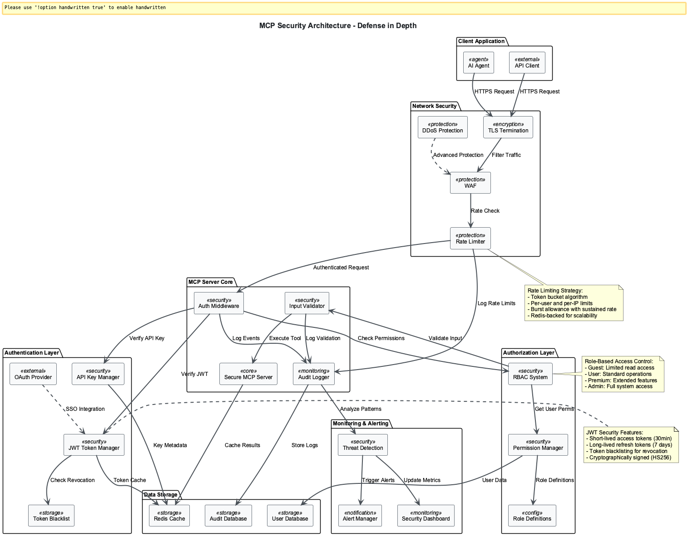

# 🎯📝 Session 5: Secure MCP Servers

## The Digital Fort Knox: Building Impenetrable MCP Servers

Picture this: You've just built the most sophisticated MCP server the world has ever seen. It can manage files, query databases, call APIs, and orchestrate complex workflows with surgical precision. But then, at 3 AM on a Tuesday, your phone buzzes with an urgent alert. Someone has breached your server, stolen sensitive data, and is using your AI agent to wreak havoc across your entire infrastructure.

This nightmare scenario is exactly why security isn't just an afterthought in MCP development—it's the foundation upon which everything else stands. Today, we're going to transform your MCP server from a sitting duck into a digital fortress that would make even the most determined attackers think twice.

*Welcome to the world of enterprise-grade MCP security, where every line of code is a guardian at the gate.*



## 🎯📝⚙️ Learning Path Overview

This session offers three distinct learning paths designed to match your goals and time investment:

=== "🎯 Observer (30-60 min)"

    **Focus**: Understanding concepts and architecture
    
    **Activities**: Essential security threats, authentication concepts, rate limiting principles
    
    **Ideal for**: Decision makers, architects, overview learners

=== "📝 Participant (3-5 hours)"

    **Focus**: Guided implementation and analysis
    
    **Activities**: Build secure MCP servers, implement authentication, deploy security measures
    
    **Ideal for**: Developers, technical leads, hands-on learners

=== "⚙️ Implementer (6-8 hours)"

    **Focus**: Complete implementation and customization
    
    **Activities**: Enterprise security patterns, advanced threat mitigation, compliance frameworks
    
    **Ideal for**: Senior engineers, architects, specialists

## 🎯 Observer Path: Essential Security Concepts

### Learning Outcomes

By completing this Observer path, you will understand:

- The six critical security threats to MCP servers  
- Modern security standards and their purposes  
- Basic authentication and authorization concepts  
- How rate limiting protects system resources  

### The Six Critical Security Threats

Before we build our defenses, we need to understand our enemies. In the world of MCP servers, threats don't just knock politely at your front door—they probe every weakness, exploit every vulnerability, and strike when you least expect it.

Imagine your MCP server as a medieval castle. These are the siege engines that attackers will use to breach your walls:

1. **Token Misuse Across Resources**: Like a master key falling into the wrong hands, a stolen token can unlock doors you never intended to open. One compromised token suddenly grants access to your entire digital kingdom.  

2. **Authorization Code Interception**: Picture a messenger carrying secret scrolls being ambushed on the road. Without PKCE protection, attackers can intercept authorization codes and masquerade as legitimate users.  

3. **Unintended LLM Actions**: Your AI agent receives what looks like an innocent request: "Delete some old files." But those "old files" happen to be your entire database backup. The AI, trusting by nature, complies without question.  

4. **Privilege Escalation**: A humble user account somehow gains administrator privileges, like a janitor mysteriously acquiring master keys to every room in a building. Small permissions snowball into system-wide control.  

5. **Distributed Rate Limit Bypass**: Attackers coordinate like a swarm of locusts, each request appearing innocent, but together overwhelming your defenses faster than you can count.  

6. **Data Exfiltration**: Through carefully crafted queries that look perfectly legitimate, attackers slowly siphon your most sensitive data, one seemingly innocent API call at a time.  

### Modern Security Standards

Our fortress needs more than just thick walls—it needs a comprehensive defense system:

1. **OAuth 2.1 with PKCE**: The modern standard that treats every authorization request like a secret handshake with cryptographic verification  
2. **Resource Indicators (RFC 8707)**: Tokens that can only unlock specific doors, preventing the skeleton key problem  
3. **Sandbox Isolation**: Running your MCP servers in protected bubbles, where even a breach can't spread beyond its boundaries  

### Basic Token Concepts

Think of tokens as digital ID cards with sophisticated security features:

- **Access Tokens**: Short-lived credentials (30 minutes) for immediate use  
- **Refresh Tokens**: Long-lived credentials (7 days) for renewing access tokens  
- **Token Blacklisting**: A master "do not admit" list for revoked credentials  

### Rate Limiting Fundamentals

Rate limiting is like having a sophisticated bouncer who ensures fair access:

- **Token Bucket Algorithm**: Nature's perfect approach to resource distribution  
- **Role-Based Limits**: Different users get different levels of service  
- **Distributed Protection**: Works across multiple server instances  

## 📝 Participant Path: Practical Security Implementation

*Prerequisites: Complete Observer Path sections above*

### Learning Outcomes

By completing this Participant path, you will be able to:

- Implement PKCE authentication flow  
- Create secure JWT token management  
- Build role-based access control systems  
- Deploy rate limiting middleware  

### PKCE Implementation Basics

PKCE (Proof Key for Code Exchange) is like having a unique puzzle piece that only you can solve. Here's the essential implementation:

```python
import secrets
import hashlib
import base64
from cryptography.hazmat.primitives import hashes

class PKCEGenerator:
    """RFC 7636 PKCE implementation for MCP OAuth 2.1."""

    @staticmethod
    def generate_code_verifier() -> str:
        """Generate cryptographically secure code verifier."""
        code_verifier = base64.urlsafe_b64encode(
            secrets.token_bytes(96)
        ).decode('utf-8').rstrip('=')

        return code_verifier
```

The code verifier uses 96 bytes of cryptographically secure random data, encoded as URL-safe base64. This creates an unpredictable string that attackers cannot guess.

Now we create the corresponding challenge:

```python
    @staticmethod
    def generate_code_challenge(verifier: str) -> tuple[str, str]:
        """Generate code challenge from verifier using SHA256."""
        digest = hashes.Hash(hashes.SHA256())
        digest.update(verifier.encode('utf-8'))
        challenge = base64.urlsafe_b64encode(
            digest.finalize()
        ).decode('utf-8').rstrip('=')

        return challenge, "S256"
```

The challenge is a SHA256 hash of the verifier—attackers who intercept the challenge still can't derive the original verifier.

### JWT Token Management Essentials

Your JWT manager acts like a sophisticated bank vault that creates and validates digital credentials:

```python
import jwt
from datetime import datetime, timedelta, timezone
import os

class JWTManager:
    """JWT token management with security best practices."""

    def __init__(self, secret_key: str = None):
        self.secret_key = secret_key or os.getenv('JWT_SECRET_KEY')
        self.algorithm = "HS256"
        self.access_token_expire_minutes = 30
        self.refresh_token_expire_days = 7

        # Validate secret key security
        if len(self.secret_key) < 32:
            raise ValueError("JWT secret key must be at least 32 characters")
```

The 30-minute access token lifetime strikes a balance between security and usability—short enough to limit exposure if compromised, but long enough to avoid constant re-authentication.

Creating secure tokens with proper claims:

```python
    def create_tokens(self, user_data: dict) -> dict:
        """Create access and refresh tokens with proper security claims."""
        now = datetime.now(timezone.utc)

        # Access token with user permissions
        access_payload = {
            "sub": user_data["user_id"],
            "username": user_data["username"],
            "roles": user_data.get("roles", ["user"]),
            "permissions": user_data.get("permissions", []),
            "iat": now,
            "exp": now + timedelta(minutes=self.access_token_expire_minutes),
            "type": "access"
        }

        # Refresh token (minimal claims for security)
        refresh_payload = {
            "sub": user_data["user_id"],
            "iat": now,
            "exp": now + timedelta(days=self.refresh_token_expire_days),
            "type": "refresh"
        }

        return {
            "access_token": jwt.encode(access_payload, self.secret_key, algorithm=self.algorithm),
            "refresh_token": jwt.encode(refresh_payload, self.secret_key, algorithm=self.algorithm),
            "token_type": "bearer",
            "expires_in": self.access_token_expire_minutes * 60
        }
```

Notice the "type" claim—this prevents token confusion attacks where refresh tokens might be used as access tokens.

### Role-Based Access Control (RBAC) Implementation

RBAC is like having a sophisticated court system where each person's role determines exactly which doors they can open:

```python
from enum import Enum
from typing import List, Set, Dict
from functools import wraps

class Permission(Enum):
    """Fine-grained permissions for MCP server resources."""
    READ_WEATHER = "weather:read"
    WRITE_WEATHER = "weather:write"
    READ_FILES = "files:read"
    WRITE_FILES = "files:write"
    DELETE_FILES = "files:delete"
    ADMIN_USERS = "admin:users"
    VIEW_METRICS = "metrics:view"

class Role(Enum):
    """Hierarchical roles from least to most privileged."""
    GUEST = "guest"
    USER = "user"
    PREMIUM = "premium"
    ADMIN = "admin"
```

The role hierarchy works like a medieval court structure, where each level inherits the privileges of those below:

```python
ROLE_PERMISSIONS: Dict[Role, Set[Permission]] = {
    Role.GUEST: {
        Permission.READ_WEATHER
    },
    Role.USER: {
        Permission.READ_WEATHER,
        Permission.READ_FILES
    },
    Role.PREMIUM: {
        Permission.READ_WEATHER, Permission.WRITE_WEATHER,
        Permission.READ_FILES, Permission.WRITE_FILES
    },
    Role.ADMIN: {
        perm for perm in Permission  # All permissions
    }
}
```

Creating the permission decorator for MCP tools:

```python
def require_permission(required_permission: Permission):
    """Decorator to enforce permission requirements on MCP tools."""
    def decorator(tool_func):
        @wraps(tool_func)
        async def wrapper(*args, **kwargs):
            current_user = get_current_user()
            if not current_user:
                raise HTTPException(status_code=401, detail="Authentication required")

            user_permissions = current_user.get("permissions", [])
            if required_permission.value not in user_permissions:
                raise HTTPException(
                    status_code=403,
                    detail=f"Permission '{required_permission.value}' required"
                )

            return await tool_func(*args, **kwargs)
        return wrapper
    return decorator
```

### Basic Rate Limiting Implementation

Rate limiting is like having a digital bouncer who ensures everyone gets fair access:

```python
import time
import json
from typing import Dict

class SimpleRateLimiter:
    """Basic token bucket rate limiter for MCP servers."""

    def __init__(self, capacity: int = 100, refill_rate: float = 10):
        self.capacity = capacity
        self.refill_rate = refill_rate  # tokens per second
        self.buckets: Dict[str, Dict] = {}

    def is_allowed(self, identifier: str) -> bool:
        """Check if request should be allowed based on rate limit."""
        current_time = time.time()

        # Initialize bucket if first request
        if identifier not in self.buckets:
            self.buckets[identifier] = {
                "tokens": float(self.capacity),
                "last_refill": current_time
            }

        bucket = self.buckets[identifier]

        # Calculate tokens to add based on time elapsed
        time_elapsed = current_time - bucket["last_refill"]
        tokens_to_add = time_elapsed * self.refill_rate

        # Add tokens but don't exceed capacity
        bucket["tokens"] = min(
            float(self.capacity),
            bucket["tokens"] + tokens_to_add
        )
        bucket["last_refill"] = current_time

        # Check if request can be allowed
        if bucket["tokens"] >= 1.0:
            bucket["tokens"] -= 1.0
            return True

        return False
```

### Secured MCP Server Integration

Now let's combine all security components into a production-ready MCP server:

```python
from mcp.server.fastmcp import FastMCP
from fastapi import Request, HTTPException

class SecureMCPServer:
    """Production-ready MCP server with comprehensive security."""

    def __init__(self, name: str = "Secure MCP Server"):
        self.mcp = FastMCP(name)
        self.jwt_manager = JWTManager()
        self.rate_limiter = SimpleRateLimiter()
        self.setup_security_tools()

    def setup_security_tools(self):
        """Configure MCP tools with appropriate security controls."""

        @self.mcp.tool()
        @require_permission(Permission.READ_WEATHER)
        async def get_weather(city: str) -> Dict:
            """Get weather data - requires weather:read permission."""
            if not city or len(city) > 100:
                raise HTTPException(status_code=400, detail="Invalid city name")

            return {
                "city": city,
                "temperature": 22,
                "condition": "Sunny",
                "timestamp": datetime.now().isoformat()
            }
```

Each MCP tool becomes a secured endpoint with appropriate permission checks and input validation.

## ⚙️ Implementer Path: Advanced Security Architecture

*Prerequisites: Complete Observer and Participant paths*

For comprehensive deep-dive coverage of advanced security topics, continue with:

- ⚙️ [Advanced OAuth 2.1 Implementation](Session5_Advanced_OAuth.md)  
- ⚙️ [Enterprise API Key Management](Session5_Enterprise_API_Keys.md)  
- ⚙️ [Production Rate Limiting Systems](Session5_Production_Rate_Limiting.md)  
- ⚙️ [Security Monitoring & Audit Systems](Session5_Security_Monitoring.md)  

## 📝 Practice Exercises

### Observer Level Exercises

1. **Threat Assessment**: Identify which of the six security threats would be most concerning for a file management MCP server and explain why.  

2. **Security Standard Selection**: Compare OAuth 2.1 with PKCE versus basic API key authentication for different use cases.  

### Participant Level Exercises

3. **PKCE Flow Implementation**: Implement the complete PKCE authorization flow including code challenge generation and verification.  

4. **Role Design**: Design a role hierarchy for an e-commerce MCP server with appropriate permissions for different user types.  

5. **Rate Limiting Configuration**: Configure rate limits for a multi-tenant MCP server where different customers need different service levels.  

### Advanced Integration Exercise

6. **Secure MCP Server**: Build a complete secure MCP server that includes:  
   - OAuth 2.1 with PKCE authentication  
   - Role-based access control  
   - Rate limiting middleware  
   - Security audit logging  

## Security Knowledge Check

Test your understanding of MCP server security:

1. **Why use short-lived access tokens (30 minutes)?**  
   A) Faster authentication
   B) Limit exposure if compromised
   C) Reduce server load
   D) Easier implementation

2. **What's the purpose of token blacklisting?**  
   A) Improve performance
   B) Enable secure logout and token revocation
   C) Reduce memory usage
   D) Simplify token validation

3. **How does the token bucket algorithm work?**  
   A) Stores tokens in a database
   B) Uses fixed time windows
   C) Allows bursts but limits average rate
   D) Blocks all requests when full

**Answer Key**: 1-B, 2-B, 3-C

## 📋 Summary

You've now built a comprehensive security foundation for MCP servers that includes:

**Essential Security Components:**  
- OAuth 2.1 with PKCE authentication  
- JWT token system with proper lifecycle management  
- Role-based access control with fine-grained permissions  
- Rate limiting using token bucket algorithm  
- Input validation and secure error handling  

**Security Best Practices Applied:**  
- Defense in depth with multiple security layers  
- Fail-secure design principles  
- Principle of least privilege  
- Comprehensive audit logging  

Your MCP server is now protected against the most common attack vectors while maintaining usability and performance.

---

## 🧭 Navigation

**Previous:** [Session 4 - Team Orchestration →](Session4_Production_MCP_Deployment.md)  
**Next:** [Session 6 - Modular Architecture →](Session6_ACP_Fundamentals.md)

---
