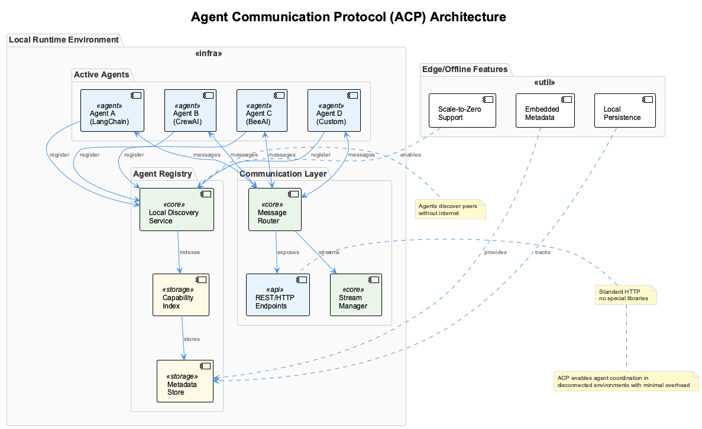

# 🎯📝⚙️ Session 6: Agent Communication Protocol (ACP) - Local-First Multi-Agent Networks

## 🎯📝⚙️ Learning Path Overview

This session offers three distinct learning paths designed to match your goals and time investment:

=== "🎯 Observer (45-60 min)"

    **Focus**: Understanding concepts and architecture
    
    **Activities**: ACP fundamentals, local-first principles, multi-agent communication
    
    **Ideal for**: Decision makers, architects, overview learners

=== "📝 Participant (2-3 hours)"

    **Focus**: Guided implementation and analysis
    
    **Activities**: Build and deploy ACP agent networks, implement communication protocols
    
    **Ideal for**: Developers, technical leads, hands-on learners

=== "⚙️ Implementer (4-5 hours)"

    **Focus**: Complete implementation and customization
    
    **Activities**: Complex agent orchestration, production patterns, advanced networking
    
    **Ideal for**: Senior engineers, architects, specialists

## 🎯 The Great Disconnection: When Agents Need to Work Without the Cloud

Imagine you're building an AI system for a hospital's emergency room. Suddenly, the internet goes down. Your cloud-dependent agents stop talking to each other just when doctors need them most. Patients are arriving, data needs processing, and decisions must be made—but your agents are silent because they can't reach their cloud coordinator.

This scenario isn't just hypothetical. It happens every day in factories, remote research stations, autonomous vehicles, and yes, hospitals. What if we told you there's a way to build multi-agent systems that work flawlessly whether they're connected to the internet or completely offline? A protocol that makes agents as reliable as having a conversation with someone sitting right next to you?

*Welcome to the Agent Communication Protocol (ACP)—where local-first isn't just a design philosophy, it's a digital lifeline.*



## 🎯 Part 1: The Revolution of Local-First Thinking

Before we dive deep into the code, let's understand why ACP represents a fundamental shift in how we think about agent collaboration.

### The Old World: Cloud Dependency Chains

In the traditional approach, every agent interaction becomes a complex dance through the cloud:

**Traditional Cloud-Centric:**

```
Agent A → Cloud API Gateway → Message Queue → Agent B
   ↓         (requires internet)         (high latency)     ↓
Complex setup     Security risks        Dependency failure    Cost scaling
```

Every message bounces through external servers, adding latency, cost, and potential failure points. Your agents become digital puppets, unable to move without their cloud-based puppet master.

### The New World: Local-First Liberation

ACP flips this model on its head with elegant simplicity:

**ACP Local-First:**

```
Agent A ←→ Local Event Bus ←→ Agent B
   ↓      (IPC/local network)     ↓
RESTful API    Millisecond latency    Autonomous operation
```

Now your agents talk directly to each other, like colleagues in the same office. No intermediaries, no external dependencies, just pure, efficient communication.

### The Three-Layer Architecture That Changes Everything

ACP defines three core layers based on the IBM BeeAI standard, each solving a specific coordination challenge:

1. **Discovery Layer**: Like having a receptionist who knows everyone's capabilities—agents broadcast what they can do through local networks without needing external directories  
2. **Communication Layer**: Pure RESTful interfaces that any system can understand, creating universal compatibility  
3. **Coordination Layer**: Event-driven patterns that orchestrate complex workflows faster than human thought  

### Why This Matters in the Real World

The benefits extend far beyond technical elegance:

- **Decentralized Discovery**: Agents find each other naturally, like neighbors introducing themselves  
- **RESTful Communication**: No proprietary protocols—if it speaks HTTP, it can join the conversation  
- **Event-Driven Architecture**: Real-time coordination with the responsiveness of local networks  
- **Autonomous Operation**: Full functionality even when the internet disappears  
- **Sub-Millisecond Latency**: Local communication that's faster than human perception  

## 📝 Part 2: Building Your First ACP Agent Society

*Prerequisites: Complete 🎯 Observer Path sections above*

Let's start building a society of agents that can work together seamlessly. We'll create this step by step, starting with the fundamental building blocks.

### The DNA of an Agent: Capabilities Declaration

Every intelligent agent needs to declare what it can do. Think of this as creating a digital resume that other agents can read and understand:

```python
# From src/session6/acp_agent.py
class AgentCapability(BaseModel):
    """Defines what an agent can do"""
    name: str                    # e.g., "process_data"
    description: str             # Human-readable description
    input_schema: Dict[str, Any] # What parameters it needs
    output_schema: Dict[str, Any] # What it returns
```

This capability model serves as a contract between agents, enabling them to understand each other's services without manual configuration.

### A Real-World Example: The Weather Oracle

Let's create a weather agent that other agents can consult:

```python
weather_capability = AgentCapability(
    name="get_weather",
    description="Get current weather for any city",
    input_schema={
        "type": "object",
        "properties": {
            "city": {"type": "string", "description": "City name"}
        },
        "required": ["city"]
    }
)
```

We also define the expected output structure:

```python
# Output schema defines the return format
output_schema = {
    "type": "object",
    "properties": {
        "temperature": {"type": "number"},
        "condition": {"type": "string"}
    }
}
```

This isn't just documentation—it's a contract that enables other agents to understand exactly how to work with the weather agent.

### Creating Agent Identity: More Than Just a Name

Each agent needs a complete identity that makes it discoverable and trustworthy:

```python
# From src/session6/acp_agent.py
class AgentMetadata(BaseModel):
    """Complete agent information for discovery"""
    id: str                      # Unique identifier
    name: str                    # Human-readable name
    capabilities: List[AgentCapability]  # What it can do
    endpoints: Dict[str, str]    # How to reach it
```

Additional metadata completes the agent profile:

```python
    protocols: List[str]         # Communication methods
    created_at: datetime         # When it started
```

This comprehensive metadata enables robust service discovery and trust establishment within the agent network.

### Bringing the Weather Agent to Life

Here's how our weather agent would introduce itself to the world:

```python
agent_metadata = AgentMetadata(
    id="agent-123e4567-e89b-12d3-a456-426614174000",
    name="WeatherAgent",
    capabilities=[weather_capability],
    endpoints={
        "communicate": "http://localhost:8001/communicate",
        "discover": "http://localhost:8001/discover"
    }
)
```

Complete the agent configuration:

```python
# Additional metadata
metadata.protocols = ["http"]
metadata.created_at = datetime.now()
```

This self-describing approach allows agents to join the network dynamically without manual configuration.

### The Universal Language: Standard ACP Endpoints

Every ACP agent speaks the same language through four standard REST endpoints. Think of these as universal verbs that any agent can understand:

```python
# From src/session6/acp_agent.py - Core endpoints
@app.get("/metadata")
async def get_metadata():
    """Return this agent's information"""
    return self.metadata

@app.post("/communicate")
async def communicate(message: ACPMessage):
    """Handle requests from other agents"""
    return await self.handle_message(message)
```

These core endpoints enable basic agent interaction. The additional endpoints complete the agent's social capabilities:

```python
@app.get("/discover")
async def discover(capability: Optional[str] = None):
    """Find other agents, optionally filtered by capability"""
    return await self.discover_agents(capability)

@app.get("/status")
async def get_status():
    """Health check - is this agent working?"""
    return {"status": "active", "uptime": "..."}
```

This standardized interface ensures any system can participate in the ACP network using familiar HTTP protocols.

## 📝 Part 3: Creating a Specialized Agent Ecosystem

*Prerequisites: Complete 🎯 Observer Path and 📝 Part 2 sections above*

Now comes the exciting part—building specialized agents that excel at specific tasks and can work together to solve complex problems.

### The Data Whisperer: Your CSV Processing Specialist

Our first specialist is a master of data analysis, capable of turning raw CSV files into meaningful insights:

### Declaring Its Expertise

```python
# From src/session6/data_agent.py
capabilities = [
    AgentCapability(
        name="process_csv",
        description="Process CSV data with various operations",
        input_schema={
            "type": "object",
            "properties": {
                "data": {"type": "string"},  # CSV as text
                "operation": {"type": "string"}
            }
        }
    )
]
```

The operation parameter supports multiple analysis types:

```python
# Supported operations
operations = ["summary", "filter", "analyze", "transform"]
```

This capability declaration makes the data agent's services discoverable and callable by other agents in the network.

### The Intelligence Behind the Interface

```python
async def execute_capability(self, capability_name: str, payload: dict) -> dict:
    """Route capability requests to specific handlers"""

    if capability_name == "process_csv":
        return await self._process_csv(payload)
    else:
        return {"error": f"Unknown capability: {capability_name}"}
```

This routing pattern enables clean separation of concerns, where each capability has its dedicated handler method.

### Watching It Work Its Magic

The core CSV processing logic demonstrates the agent's analytical capabilities:

```python
async def _process_csv(self, payload: dict) -> dict:
    data_str = payload["data"]
    operation = payload["operation"]

    # Parse CSV using pandas
    df = pd.read_csv(StringIO(data_str))
```

Handling different operation types:

```python
    if operation == "summary":
        return {
            "result": {
                "rows": len(df),
                "columns": df.columns.tolist(),
                "summary": df.describe().to_dict()
            },
            "rows_processed": len(df)
        }
```

This implementation showcases how agents can provide sophisticated data processing capabilities through simple, standardized interfaces.

**See It in Action:** Start the data agent and give it a test:

```bash
curl -X POST http://localhost:8001/communicate \
  -H "Content-Type: application/json" \
  -d '{
    "id": "test-1",
    "from_agent": "tester",
    "capability": "process_csv",
    "payload": {
      "data": "name,age\nJohn,25\nJane,30",
      "operation": "summary"
    }
  }'
```

This curl command demonstrates the standard ACP message format for inter-agent communication.
```

### The Language Virtuoso: Your Text Processing Expert

Our second specialist excels at understanding and manipulating human language:

### Its Natural Language Arsenal

```python
# From src/session6/text_agent.py
capabilities = [
    AgentCapability(
        name="summarize_text",
        description="Summarize text content",
        input_schema={
            "properties": {
                "text": {"type": "string"},
                "max_sentences": {"type": "integer", "default": 3}
            }
        }
    )
]
```

Additional text processing capabilities:

```python
# Extended capabilities
text_capabilities = [
    AgentCapability(
        name="extract_keywords",
        description="Extract key terms from text"
    ),
    AgentCapability(
        name="analyze_sentiment",
        description="Determine text emotional tone"
    )
]
```

This multi-capability approach allows the text agent to serve various natural language processing needs.

### The Art of Summarization

The text agent's summarization logic demonstrates effective text processing:

```python
async def _summarize_text(self, payload: dict) -> dict:
    text = payload["text"]
    max_sentences = payload.get("max_sentences", 3)

    # Simple extractive summarization
    sentences = re.split(r'[.!?]+', text)
    sentences = [s.strip() for s in sentences if s.strip()]
```

Processing and returning results:

```python
    # Take first N sentences (basic approach)
    summary = '. '.join(sentences[:max_sentences])

    return {
        "summary": summary,
        "original_length": len(text),
        "summary_length": len(summary)
    }
```

This implementation provides practical text summarization while maintaining metrics for quality assessment.

## ⚙️ The Master Orchestrator: Coordination Agent

*Prerequisites: Complete 🎯 Observer Path and 📝 Participant sections above*

Here's where the magic of ACP really shines. The coordinator agent doesn't process data itself—it's like a conductor directing an orchestra of specialized agents to create something beautiful together.

### The Art of Coordination: Discovery, Validation, and Execution

ACP coordination follows a carefully choreographed dance. Let's break down each movement:

### Movement 1: The Great Discovery

```python
# From src/session6/coordinator_agent.py - Discovery phase
async def _execute_data_analysis_workflow(self, input_data: dict) -> dict:
    agents_used = []

    # Step 1: Discover required agents using capability-based lookup
    print("🔍 Discovering agents...")
    data_agents = await self.discover_agents("process_csv")
    text_agents = await self.discover_agents("summarize_text")
```

Validation ensures workflow reliability:

```python
    # Validate agents are available before proceeding
    if not data_agents or not text_agents:
        raise ValueError("Required agents not available")
```

Like a detective searching for the right experts, the coordinator first identifies which agents are available and capable of handling specific tasks.

### Movement 2: The Data Symphony

```python
    # Step 2: Coordinate data processing with the discovered agent
    print("📊 Processing data...")
    data_result = await self.communicate_with_agent(
        data_agents[0].id,           # Target the first available data agent
        "process_csv",               # Request specific capability
        {"data": input_data["csv_data"], "operation": "summary"}
    )
```

Tracking workflow participation:

```python
    # Track which agents participated in the workflow
    agents_used.append(data_agents[0].id)
```

Now the coordinator directs the data agent to analyze the information, like a conductor cueing the strings section.

### Movement 3: The Final Harmony

```python
    # Step 3: Generate summary using processed data
    print("📝 Generating summary...")
    summary_text = f"Analysis Results: {data_result['result']}"
    text_result = await self.communicate_with_agent(
        text_agents[0].id,
        "summarize_text",
        {"text": summary_text, "max_sentences": 2}
    )
```

Aggregating the final workflow results:

```python
    agents_used.append(text_agents[0].id)

    # Return aggregated results from multiple agents
    return {
        "data_analysis": data_result,
        "text_summary": text_result,
        "agents_used": agents_used
    }
```

The grand finale combines all the work into a coherent result, demonstrating how multiple specialists can collaborate seamlessly.

### The Philosophy of Coordination

Effective coordination requires adherence to key principles:

1. **Discovery Before Action**: Like checking who's available before planning a meeting
2. **Error Handling**: Always have a backup plan when required expertise isn't available
3. **Sequential Execution**: Build upon previous results, layer by layer
4. **Result Aggregation**: Create value greater than the sum of individual contributions

These principles ensure reliable, scalable agent orchestration in production environments.

## 📝 Part 4: The Social Network of Agents

*Prerequisites: Complete 🎯 Observer Path and previous 📝 Participant sections*

### How Digital Minds Find Each Other

In the ACP world, agents don't rely on phone books or yellow pages. They use a **local registry pattern** where agents introduce themselves to their neighbors:

```python
# From src/session6/coordinator_agent.py
async def register_with_peers(self, peer_ports: list):
    """Register with known peer agents"""

    for port in peer_ports:
        try:
            # Send our metadata to the peer
            async with aiohttp.ClientSession() as session:
                async with session.post(
                    f"http://localhost:{port}/register",
                    json=self.metadata.dict()
                ) as response:
                    if response.status == 200:
                        print(f"✅ Registered with agent on port {port}")
```

Error handling for network connectivity:

```python
        except Exception as e:
            print(f"⚠️ Could not connect to port {port}: {e}")
```

This peer registration mechanism enables automatic network formation without centralized coordination.

### The Social Introduction Protocol

Imagine agents as new neighbors moving into a digital neighborhood:

```
1. Agent A (the newcomer) starts up  
2. Agent A introduces itself to known neighbors (ports 8001, 8002)  
3. Neighbors remember Agent A's capabilities in their local address books  
4. When Agent A needs help, neighbors can recommend the right specialist  
5. Agent A can now collaborate with the entire neighborhood  
```

This decentralized approach eliminates single points of failure while maintaining network coherence.

### Making Introductions: Discovery in Action

```python
# Find all agents that can process CSV
data_agents = await self.discover_agents("process_csv")

# Find any available agents
all_agents = await self.discover_agents()
```

It's as simple as asking: "Does anyone here know how to handle spreadsheets?" or "Who's around to help with a project?"

This capability-based discovery enables dynamic workflow composition based on available resources.

## 📝 Part 5: Launching Your Agent Metropolis

*Prerequisites: Complete 🎯 Observer Path and previous 📝 Participant sections*

### The Bootstrap: Bringing the City to Life

Managing multiple agents manually would be like trying to coordinate a city by running around to each building individually. Instead, we've created a bootstrap script that acts like a city planner:

```python
# From src/session6/bootstrap.py - simplified
agents = [
    {"script": "data_agent.py", "port": 8001, "name": "DataProcessor"},
    {"script": "text_agent.py", "port": 8002, "name": "TextProcessor"},
    {"script": "coordinator_agent.py", "port": 8000, "name": "Coordinator"}
]
```

Agent startup orchestration:

```python
for agent in agents:
    print(f"Starting {agent['name']} on port {agent['port']}...")
    process = subprocess.Popen([sys.executable, agent["script"]])
    time.sleep(2)  # Let each agent start
```

This bootstrap approach enables rapid deployment of multi-agent systems with proper initialization sequencing.

### Awakening the Network

```bash
cd src/session6
pip install -r requirements.txt
python bootstrap.py
```

This simple command sequence initializes the entire agent network, demonstrating ACP's deployment simplicity.

### The City Comes Alive

```
Starting ACP Agent Network...
   🔧 Starting DataProcessor on port 8001...
   🔧 Starting TextProcessor on port 8002...
   🔧 Starting Coordinator on port 8000...

✅ All agents started successfully!

🔍 ACP Network Status:
DataProcessor    | Port 8001 | 🟢 Running
TextProcessor    | Port 8002 | 🟢 Running
Coordinator      | Port 8000 | 🟢 Running
```

This status output confirms successful network initialization and provides operational visibility.

### Putting the Network Through Its Paces

Now let's see our digital society in action:

```bash
python test_client.py
```

This test client acts like a quality inspector, verifying that all the social interactions work perfectly.

### Watching Excellence in Motion

```
🧪 ACP Agent Network Test Suite
🔍 Testing Agent Discovery...
✅ Found 2 agents:  
  - DataProcessor (capabilities: ['process_csv', 'analyze_data'])  
  - TextProcessor (capabilities: ['summarize_text', 'extract_keywords'])  

📊 Testing Data Processing Agent...
   ✅ Data processing successful
   Processed 4 rows
   📋 Columns: ['name', 'age', 'city', 'salary']

🔄 Testing Workflow Orchestration...
   📤 Sending workflow request...
   ✅ Workflow completed successfully
   🤝 Agents coordinated: ['DataProcessor', 'TextProcessor']
```

## ⚙️ Part 6: The Language of Digital Collaboration

*Prerequisites: Complete 🎯 Observer Path and 📝 Participant sections above*

### The Universal Message Format

Every conversation between agents follows a standardized format—think of it as diplomatic protocol for digital minds:

```python
# From src/session6/acp_agent.py
class ACPMessage(BaseModel):
    id: str                    # Unique message ID
    from_agent: str           # Who sent it
    to_agent: Optional[str]   # Who should receive it (optional)
    capability: str           # What to do
    payload: Dict[str, Any]   # Input parameters
```

Message type classification:

```python
    message_type: str = "request"  # request/response/notification
```

This standardized format ensures consistent communication across all agent implementations.

### A Complete Conversation: From Request to Resolution

Let's eavesdrop on a complete workflow execution and see how these digital minds collaborate:

**1. The Client's Request (like placing an order):**

```json
{
  "id": "workflow-123",
  "from_agent": "test-client",
  "capability": "orchestrate_workflow",
  "payload": {
    "workflow": "data_analysis_report",
    "input_data": {"csv_data": "name,age\nJohn,25"}
  }
}
```

This initial request demonstrates the standard ACP message structure for workflow initiation.

**2. The Coordinator's Intelligence Gathering:**

```bash
GET http://localhost:8000/discover?capability=process_csv

# Returns: [{"id": "data-agent-456", "name": "DataProcessor", ...}]
```

This discovery request demonstrates how coordinators locate required capabilities dynamically.

**3. The Coordinator's Task Assignment:**

```json
{
  "id": "msg-789",
  "from_agent": "coordinator-123",
  "to_agent": "data-agent-456",
  "capability": "process_csv",
  "payload": {
    "data": "name,age\nJohn,25",
    "operation": "summary"
  }
}
```

**4. The Data Agent's Professional Response:**

```json
{
  "id": "response-101",
  "correlation_id": "msg-789",
  "from_agent": "data-agent-456",
  "result": {
    "rows_processed": 1,
    "result": {"columns": ["name", "age"], "shape": [1, 2]}
  },
  "status": "success"
}
```

**5. The Coordinator's Second Assignment:**

```json
{
  "capability": "summarize_text",
  "payload": {
    "text": "Analysis Results: 1 row with columns name, age",
    "max_sentences": 2
  }
}
```

**6. The Final Masterpiece Delivered:**

```json
{
  "result": {
    "data_analysis": {...},
    "text_summary": {...},
    "workflow_status": "completed"
  },
  "agents_used": ["DataProcessor", "TextProcessor"]
}
```

This conversation demonstrates how ACP enables sophisticated collaboration with simple, standardized messages.

## The Philosophy of Local-First Intelligence

As we wrap up this journey into ACP fundamentals, let's reflect on what we've accomplished and why it matters:

### The Five Pillars of ACP Excellence

1. **Local-First Design**: Your agents work whether connected to the world or isolated in a bunker—true digital autonomy
2. **Standard REST**: No proprietary protocols or special libraries—if it speaks HTTP, it's welcome in the conversation
3. **Capability-Based Discovery**: Agents find each other by what they can do, not who they are—merit-based collaboration
4. **Orchestration Pattern**: Coordinator agents conduct symphonies of specialist agents without doing the work themselves
5. **Error Resilience**: Always check if the team is assembled before starting the performance

### The Transformation We've Witnessed

We started with the problem of cloud-dependent agents failing when disconnected. We've ended with a society of digital minds that can collaborate seamlessly whether they're in the same computer, the same building, or completely cut off from the outside world.

This isn't just about technology—it's about creating AI systems that are reliable when it matters most. Emergency rooms, autonomous vehicles, space stations, and military operations can't afford to wait for cloud connectivity. They need agents that think and collaborate like humans do: locally, immediately, and intelligently.

## ⚙️ The Road Ahead

In our next adventure, you'll discover how these local ACP agents can extend their reach beyond their immediate neighborhood. We'll explore the **Agent-to-Agent (A2A) Protocol** that enables enterprise-scale collaboration across organizational boundaries—imagine your local agent society forming alliances and partnerships with agent societies around the world.

But that's a story for another session. For now, take pride in what you've built: a foundation for truly autonomous, collaborative AI that works regardless of the connectivity chaos around it.

## ⚙️ Test Your ACP Mastery

Before we venture into the wider world of agent collaboration, let's ensure you've mastered the fundamentals:

**Question 1:** What is the primary purpose of the Agent Communication Protocol (ACP)?  
A) To provide internet-dependent agent communication  
B) To replace REST APIs entirely  
C) To facilitate local-first agent coordination with minimal overhead  
D) To enable cloud-based agent coordination  

**Question 2:** What is the main advantage of ACP over traditional cloud-dependent agent protocols?  
A) Higher performance  
B) Easier implementation  
C) Better security  
D) Offline capability and low latency  

**Question 3:** What information must an ACP agent capability declaration include?  
A) Only the agent ID  
B) Only the capability name  
C) Just the input parameters  
D) Name, description, input schema, and output schema  

**Question 4:** How do ACP agents discover each other's capabilities?  
A) Via embedded metadata and local REST endpoints  
B) Through a centralized cloud registry  
C) Through manual configuration files  
D) Using UDP broadcasts only  

**Question 5:** What communication protocol does ACP use for agent interactions?  
A) WebSocket  
B) gRPC  
C) Custom binary protocol  
D) Standard HTTP/REST  

**Question 6:** What role does the coordinator agent play in ACP architectures?  
A) Provides security authentication  
B) Orchestrates multi-agent workflows and manages task distribution  
C) Stores all data permanently  
D) Acts as a backup for other agents  

**Question 7:** Why are specialized agents (like data agents and text agents) beneficial in ACP systems?  
A) They cost less to deploy  
B) They require less memory  
C) They provide focused expertise and better task delegation  
D) They are faster than general-purpose agents  

**Question 8:** How do agents register their services in an ACP system?  
A) Through manual configuration  
B) Using external service registries only  
C) Through database entries  
D) By exposing standardized metadata endpoints  

**Question 9:** What is the purpose of the local registry in ACP systems?  
A) To store all agent data  
B) To provide internet connectivity  
C) To facilitate agent discovery and capability lookup  
D) To handle authentication  

**Question 10:** Why is ACP designed to be framework-agnostic?  
A) To improve performance  
B) To simplify testing  
C) To enable integration with any agent implementation  
D) To reduce development costs  

[View Solutions →](Session6_Test_Solutions.md)
---

## Navigation

**Previous:** [Session 5 - Type-Safe Development →](Session5_*.md)  
**Next:** [Session 7 - Agent Systems →](Session7_*.md)

---
