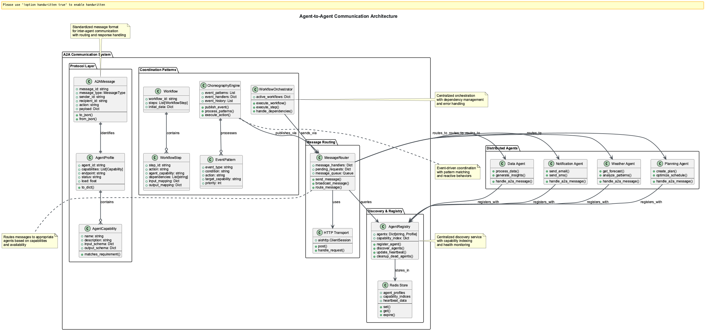

# 🎯📝⚙️ Session 7: Agent-to-Agent Communication Hub

## The Grand Alliance: When Digital Minds Must Unite

Picture this: You're witnessing the formation of the United Nations, but instead of human diplomats around a conference table, you're watching AI agents from different organizations, platforms, and purposes coming together for the first time. Each agent speaks its own technical dialect, operates under different protocols, and serves different masters—yet they must find a way to collaborate on challenges too complex for any single mind to solve.

This is the reality of modern AI systems. Your weather prediction agent in the cloud needs to coordinate with a logistics agent on a factory floor. Your data analysis agent running in a hospital must collaborate with research agents in laboratories across the world. Your financial trading agent has to work with risk assessment agents, market data agents, and compliance agents in real-time harmony.

*Welcome to Agent-to-Agent (A2A) Communication—where artificial minds learn the art of diplomacy, cooperation, and collective intelligence.*



## 🎯📝⚙️ Learning Path Overview

This session offers three distinct learning paths designed to match your goals and time investment:

=== "🎯 Observer (45-60 min)"

    **Focus**: Understanding concepts and architecture
    
    **Activities**: Core A2A communication principles, digital diplomacy, embassy system basics
    
    **Ideal for**: Decision makers, architects, overview learners

=== "📝 Participant (2-3 hours)"

    **Focus**: Guided implementation and analysis
    
    **Activities**: Implement basic A2A systems, embassy networks, message routing
    
    **Ideal for**: Developers, technical leads, hands-on learners

=== "⚙️ Implementer (8-10 hours)"

    **Focus**: Complete implementation and customization
    
    **Activities**: Enterprise A2A systems, advanced orchestration, choreography patterns
    
    **Ideal for**: Senior engineers, architects, specialists

---

## 🎯 Part 1: The Universal Language of Digital Diplomacy

Before agents can collaborate, they need to establish diplomatic protocols—a universal language that transcends the boundaries of individual platforms, organizations, and technical implementations.

### The Five Pillars of A2A Civilization

Think of A2A as the constitution for a society of digital minds:

1. **Agent Cards**: Like diplomatic credentials, these JSON documents announce what each agent can do, where to find them, and how to work with them  
2. **Task Management**: A formal lifecycle that tracks every collaboration from initial request to final resolution  
3. **Message Exchange**: JSON-RPC 2.0 over HTTP(S)—the diplomatic language that any agent can speak and understand  
4. **Authentication**: Enterprise-grade security that ensures only authorized agents can participate in sensitive collaborations  
5. **Distributed Coordination**: The ability to track complex, multi-step collaborations across organizational boundaries  

### The DNA of Agent Diplomacy: Message Structure

Every conversation between agents follows a carefully designed diplomatic protocol. Like formal diplomatic correspondence, each message contains essential metadata for proper routing, processing, and response.

The A2A protocol defines essential data structures for agent communication:

```python
# Core A2A imports and enums
from typing import Dict, Any, List, Optional
from dataclasses import dataclass
from datetime import datetime, timezone
from enum import Enum
import uuid
```

These imports establish the foundation for type-safe A2A communication with proper data validation.

```python
# Task lifecycle states
class TaskState(Enum):
    SUBMITTED = "submitted"
    PENDING = "pending"
    IN_PROGRESS = "in_progress"
    COMPLETED = "completed"
    FAILED = "failed"
    CANCELLED = "cancelled"
```

Task states provide clear lifecycle management for complex multi-agent workflows.

```python
# Message priority levels
class MessagePriority(Enum):
    LOW = "low"
    NORMAL = "normal"
    HIGH = "high"
    URGENT = "urgent"
```

Priority levels enable proper message scheduling and resource allocation in busy agent networks.

```python
# A2A Task data structure
@dataclass
class A2ATask:
    # Core identification
    task_id: str
    session_id: str = None
    correlation_id: str = None

    # Lifecycle management
    state: TaskState = TaskState.SUBMITTED
    created_at: datetime = None
    updated_at: datetime = None
```

The task structure provides comprehensive tracking and correlation capabilities for distributed agent operations.

### Digital Passports: Agent Card Implementation

Each agent in the A2A ecosystem carries a digital passport—an Agent Card that serves as both identification and capability advertisement.

Agent Cards serve as digital passports in the A2A ecosystem:

```python
# Agent Card structure - Part 1: Identity
@dataclass
class AgentCard:
    # Core agent identity
    agent_id: str
    name: str
    version: str
    description: str
```

The identity section provides essential information for agent discovery and selection.

```python
    # Capability advertisement
    capabilities: List[str]
    endpoints: Dict[str, str]
    supported_protocols: List[str] = None
```

Capability information enables intelligent agent matching for complex tasks.

```python
    # Security and operational limits
    authentication: Dict[str, Any] = None
    rate_limits: Dict[str, Any] = None
    availability: str = "24/7"
    response_time_sla: str = "<1s"
    max_concurrent_tasks: int = 10
```

Operational metadata ensures reliable service level agreements between collaborating agents.

```python
    def to_json(self) -> str:
        """Export Agent Card as JSON."""
        return json.dumps(asdict(self),
                         indent=2, default=str)
```

JSON serialization enables cross-platform agent card exchange in distributed systems.

This Agent Card is like a business card, resume, and service contract all rolled into one. Other agents can examine it to understand not just what this agent can do, but how to work with it professionally.

---

## 📝 Part 2: The Embassy System: Agent Registry and Discovery

*Prerequisites: Complete 🎯 Observer Path sections above*

Imagine a world where every embassy maintains a comprehensive directory of all diplomatic personnel from every nation. That's exactly what the Agent Registry provides—a living, breathing directory where agents announce their presence, capabilities, and availability.

### The Heart of Digital Diplomacy

The registry foundation requires several key components:

```python
# Registry foundation imports
import asyncio
import json
from typing import Dict, List, Optional, Set
from datetime import datetime, timedelta
import redis
import logging
```

These imports provide the infrastructure for distributed agent registration and discovery.

```python
# Core registry configuration
class AgentRegistry:
    def __init__(self, redis_client):
        self.redis_client = redis_client
        self.registry_prefix = "agent_registry:"
        self.capability_index = "capability_index:"
        self.heartbeat_interval = 30  # seconds
        self.heartbeat_timeout = 90   # seconds
```

Redis provides the backbone of our embassy system—fast, distributed storage that can scale from a single server to a global network of interconnected registries. The registry uses a sophisticated indexing system with capability indices—specialized phone books for finding agents with specific skills.

### The Registration Ceremony: Joining the Digital Society

When an agent joins the A2A network, it goes through a formal registration process, much like a diplomat presenting credentials at a new embassy:

```python
async def register_agent(self, profile: AgentProfile) -> bool:
    """Register an agent in the registry."""
    try:
        # Store agent profile with expiration
        profile_key = f"{self.registry_prefix}{profile.agent_id}"
        profile_data = json.dumps(profile.to_dict())

        self.redis_client.set(profile_key, profile_data)
        self.redis_client.expire(profile_key, self.heartbeat_timeout)
```

Registration stores the complete agent profile with automatic expiration to prevent stale entries.

```python
        # Index capabilities for fast lookup
        for capability in profile.capabilities:
            cap_key = f"{self.capability_index}{capability.name}"
            self.redis_client.sadd(cap_key, profile.agent_id)
            self.redis_client.expire(cap_key, self.heartbeat_timeout)

        return True
    except Exception as e:
        logger.error(f"Failed to register {profile.agent_id}: {e}")
        return False
```

Capability indexing enables instant discovery of agents with specific skills, essential for large-scale deployments.

### Graceful Departures: The Unregistration Process

When an agent needs to leave the network—whether for maintenance, shutdown, or migration—it can formally announce its departure:

```python
async def unregister_agent(self, agent_id: str) -> bool:
    """Unregister an agent from the registry."""
    try:
        # Get agent profile first
        profile = await self.get_agent_profile(agent_id)

        if profile:
            # Remove from capability indices
            for capability in profile.capabilities:
                cap_key = f"{self.capability_index}{capability.name}"
                self.redis_client.srem(cap_key, agent_id)
```

Graceful unregistration maintains registry consistency by cleaning up all associated indices.

### The Pulse of Digital Life: Heartbeat Management

Like embassies maintaining contact with their home countries, agents must regularly send heartbeats to prove they're still operational:

```python
async def update_heartbeat(self, agent_id: str, load: float = None) -> bool:
    """Update agent heartbeat and status."""
    try:
        profile = await self.get_agent_profile(agent_id)
        if not profile:
            return False

        # Update profile with current status
        profile.last_heartbeat = datetime.now().isoformat()
        if load is not None:
            profile.load = load

        # Store updated profile
        profile_key = f"{self.registry_prefix}{agent_id}"
        self.redis_client.set(profile_key,
                             json.dumps(profile.to_dict()))
        return True
    except Exception as e:
        logger.error(f"Failed to update heartbeat: {e}")
        return False
```

Heartbeat updates maintain real-time agent status for reliable load balancing and failure detection.

### Intelligent Discovery: Finding the Right Partner

The discovery process is like having a master diplomat who knows exactly which expert to call for any given challenge:

```python
async def discover_agents(self, required_capabilities: List[str] = None,
                        status_filter: str = "active",
                        max_load: float = 0.8) -> List[AgentProfile]:
    """Discover agents matching criteria."""
    try:
        candidate_agents = set()

        if required_capabilities:
            # Find agents with required capabilities
            for capability in required_capabilities:
                cap_key = f"{self.capability_index}{capability}"
                agents_with_cap = self.redis_client.smembers(cap_key)

                if not candidate_agents:
                    candidate_agents = set(agents_with_cap)
                else:
                    # Must have ALL required capabilities
                    candidate_agents = candidate_agents.intersection(agents_with_cap)
```

Discovery uses set operations to efficiently find agents that meet all specified criteria.

```python
        # Filter by status and load
        matching_agents = []
        for agent_id in candidate_agents:
            profile = await self.get_agent_profile(agent_id)

            if (profile and
                profile.status == status_filter and
                profile.load <= max_load and
                self._is_agent_alive(profile)):
                matching_agents.append(profile)

        # Sort by load (prefer less loaded agents)
        matching_agents.sort(key=lambda x: x.load)
        return matching_agents
    except Exception as e:
        logger.error(f"Failed to discover agents: {e}")
        return []
```

Intelligent sorting ensures optimal agent selection based on current load and availability.

---

## 📝 Part 3: The Message Routing Network: Digital Post Office

*Prerequisites: Complete 🎯 Observer and 📝 Participant Registry sections above*

Think of the Message Router as the world's most sophisticated post office, capable of routing millions of messages between agents while ensuring perfect delivery, handling timeouts, and managing responses.

### The Foundation of Digital Communication

```python
# Router foundation imports
import asyncio
import json
from typing import Dict, List, Optional, Callable, Any
import aiohttp
import logging
from datetime import datetime, timedelta
```

These imports provide asynchronous HTTP communication capabilities for reliable message delivery.

```python
# Message router core structure
class MessageRouter:
    def __init__(self, registry: AgentRegistry):
        self.registry = registry
        self.message_handlers: Dict[str, Callable] = {}
        self.pending_requests: Dict[str, asyncio.Future] = {}
        self.message_queue: asyncio.Queue = asyncio.Queue()
        self.session: Optional[aiohttp.ClientSession] = None
```

The router maintains critical data structures for agent discovery, message handling, request tracking, and queue management.

### The Art of Message Sending

Sending a message in the A2A world is like sending a diplomatic cable—it must be properly formatted, routed through the correct channels, and tracked until completion:

```python
async def send_message(self, message: A2AMessage,
                     wait_for_response: bool = None) -> Optional[A2AMessage]:
    """Send a message to another agent."""

    if wait_for_response is None:
        wait_for_response = message.requires_response

    try:
        # Add to message queue for processing
        await self.message_queue.put(message)

        # If response is required, wait for it
        if wait_for_response:
            future = asyncio.Future()
            self.pending_requests[message.message_id] = future
```

Message queuing with response tracking ensures reliable delivery and proper timeout handling.

```python
            try:
                response = await asyncio.wait_for(future, timeout=message.timeout)
                return response
            except asyncio.TimeoutError:
                logger.warning(f"Message {message.message_id} timed out")
                return None
            finally:
                self.pending_requests.pop(message.message_id, None)
    except Exception as e:
        logger.error(f"Failed to send message: {e}")
        return None
```

Proper timeout handling and cleanup prevent resource leaks in high-volume environments.

### Broadcasting: Speaking to the Masses

Sometimes, an agent needs to communicate with multiple agents simultaneously—like a UN secretary-general addressing all member nations:

```python
async def broadcast_message(self, message: A2AMessage,
                          capability_filter: List[str] = None) -> int:
    """Broadcast a message to multiple agents."""

    # Discover target agents
    agents = await self.registry.discover_agents(
        required_capabilities=capability_filter
    )

    sent_count = 0
    for agent in agents:
        try:
            # Create individual message for each agent
            agent_message = A2AMessage(
                sender_id=message.sender_id,
                recipient_id=agent.agent_id,
                action=message.action,
                payload=message.payload
            )
```

The broadcast function first discovers eligible agents and then creates individual messages for each target agent.

```python
            await self._route_message(agent_message)
            sent_count += 1
        except Exception as e:
            logger.error(f"Failed to send to {agent.agent_id}: {e}")

    return sent_count
```

Broadcasting enables efficient one-to-many communication patterns essential for coordinated agent activities.

### The Message Processing Engine

Behind the scenes, a dedicated task continuously processes the message queue, ensuring that every message reaches its intended destination:

```python
async def _route_message(self, message: A2AMessage):
    """Route a message to its destination."""

    if message.recipient_id:
        # Direct message to specific agent
        await self._send_to_agent(message, message.recipient_id)
    else:
        # Discover suitable agents
        agents = await self.registry.discover_agents(
            required_capabilities=message.capabilities_required
        )

        if agents:
            # Send to best available agent (lowest load)
            await self._send_to_agent(message, agents[0].agent_id)
        else:
            logger.warning(f"No suitable agents found for {message.message_id}")
```

Intelligent routing supports both direct addressing and capability-based agent selection.

---

## 🎯📝 Practice Exercises

### Exercise 1: Basic Agent Registration
Create a simple agent that registers itself with the A2A registry and responds to heartbeat requests.

### Exercise 2: Message Exchange
Implement a basic request-response pattern between two agents using the A2A message format.

### Exercise 3: Capability Discovery
Build a discovery system that finds agents based on required capabilities and load constraints.

---

## Advanced A2A Patterns

For comprehensive coverage of advanced A2A coordination patterns:

- [⚙️ Advanced Orchestration Patterns](Session7_Advanced_Orchestration.md) - Centralized workflow management  
- [⚙️ Advanced Choreography Systems](Session7_Advanced_Choreography.md) - Distributed event-driven coordination  

These advanced modules cover enterprise-scale orchestration and choreography patterns for complex multi-agent systems.

---

## Test Your Diplomatic Skills

Before we venture into advanced workflows, let's ensure you've mastered the art of agent diplomacy:

**Question 1:** What is the primary purpose of Agent-to-Agent (A2A) communication?  
A) To reduce computational costs  
B) To improve individual agent performance  
C) To enable multiple agents to collaborate and coordinate actions  
D) To replace human operators  

**Question 2:** Which component serves as a "digital passport" in A2A systems?  
A) Message Router  
B) Agent Card  
C) Task State  
D) Priority Queue  

**Question 3:** What information is essential for proper A2A message routing?  
A) Just the timestamp  
B) Only the priority level  
C) Only the message content  
D) Sender ID, recipient ID, and message type  

**Question 4:** How do agents announce their capabilities in an A2A system?  
A) Through manual configuration  
B) Via external databases only  
C) Through Agent Cards with capability metadata  
D) Through file-based configurations  

**Question 5:** What mechanism ensures A2A communication reliability when agents become unavailable?  
A) Faster processing  
B) Increased memory allocation  
C) Message queuing with retry logic and timeouts  
D) Multiple network interfaces  

**Question 6:** What is the purpose of capability negotiation in A2A systems?  
A) To improve performance  
B) To match agent capabilities with task requirements  
C) To simplify configuration  
D) To reduce costs  

**Question 7:** When should URGENT priority be used for A2A messages?  
A) For time-critical operations requiring immediate attention  
B) For data backup operations  
C) For routine status updates  
D) For all important messages  

**Question 8:** What is the purpose of correlation IDs in A2A messaging?  
A) To validate message integrity  
B) To encrypt messages  
C) To compress message content  
D) To link related messages in multi-step workflows  

**Question 9:** What is a key benefit of collaborative agent teams in A2A systems?  
A) Diverse expertise and parallel problem-solving capabilities  
B) Lower computational requirements  
C) Reduced network traffic  
D) Simpler implementation  

**Question 10:** How does the Agent Registry maintain data consistency?  
A) Through manual updates  
B) Via heartbeat monitoring and automatic cleanup  
C) Using external synchronization services  
D) Through periodic full rebuilds  

[View Solutions →](Session7_Test_Solutions.md)
---

**Next:** [Session 8 - Advanced Agent Workflows →](Session8_Advanced_Agent_Workflows.md)

---
