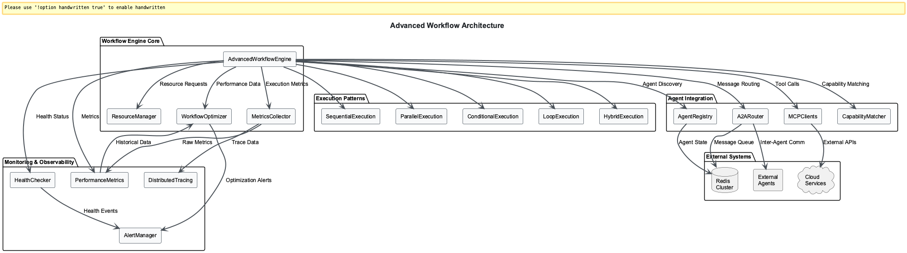

# Session 8: Advanced Agent Workflows - Enterprise Orchestration Patterns

## Learning Outcomes

By the end of this session, you will be able to:
- **Design** complex multi-agent workflows using LangGraph and enterprise orchestration patterns
- **Implement** ReAct patterns, parallel processing, and conditional routing for production systems
- **Create** fault-tolerant workflows with comprehensive error handling and adaptive optimization
- **Build** workflow monitoring and observability systems meeting enterprise SLA requirements
- **Deploy** scalable orchestration platforms addressing the 85% failure rate in agentic AI

## Chapter Overview

### What You'll Learn: Production-Grade Agentic Workflows

In this session, we'll implement the advanced agent workflow patterns that power today's leading AI teams. Moving beyond simple sequential processing, we'll explore the sophisticated orchestration patterns that enable enterprise-grade agentic AI systems to handle complex, multi-step business processes with reliability and scale.

### Why This Matters: The 2024-2025 Agentic Workflow Revolution

Based on industry research, advanced agent workflows represent the future of enterprise AI:

- **Enterprise Adoption**: According to Gartner, 33% of enterprise software will depend on agentic AI by 2028
- **Failure Rate Challenge**: Current 85% failure rate in agentic AI requires sophisticated orchestration patterns
- **Leading AI Teams**: Agentic workflows are now the cornerstone of successful AI implementations
- **Performance Impact**: Parallel processing drastically reduces time to resolution and improves consensus accuracy
- **Framework Evolution**: LangGraph's graph-based architecture and AutoGen's collaborative systems enable production deployment

### How Advanced Workflows Stand Out: Enterprise Orchestration Patterns

Modern agentic workflow patterns address real enterprise needs through sophisticated coordination:
- **Sequential Orchestration**: Step-by-step decomposition with context preservation for complex customer support
- **Parallel Processing**: Concurrent execution for code review, candidate evaluation, and A/B testing
- **Orchestrator-Worker Pattern**: Central coordination with specialized workers powering RAG and multi-modal research
- **Conditional Routing**: Dynamic task assignment based on input classification for scalable expertise
- **ReAct Pattern**: Real-time problem-solving with reasoning-action loops for adaptable agents

### Where You'll Apply This: Enterprise Workflow Use Cases

Advanced agent workflows excel in sophisticated business scenarios:
- **Multi-Domain Customer Support**: Conditional routing with specialized expertise and real-time triage
- **Code Review and Development**: Parallel processing for comprehensive analysis and consensus building
- **Financial Analysis**: Orchestrator-worker patterns for complex research and risk assessment
- **Content Generation**: Sequential workflows with context preservation across multi-turn processes
- **Quality Assurance**: Maker-checker patterns where agents debate and validate outputs together


*Figure 1: Enterprise agentic workflow architecture showing parallel processing, conditional routing, orchestrator-worker patterns, and ReAct loops working together to create resilient, scalable AI systems that overcome the 85% failure rate*

### Learning Path Options

**🎯 Observer Path (35 minutes)**: Understand advanced workflow patterns and orchestration concepts
- Focus: Quick insights into ReAct patterns, parallel processing, and enterprise coordination
- Best for: Getting oriented with production agentic workflow architecture

**📝 Participant Path (65 minutes)**: Implement working advanced workflows with LangGraph  
- Focus: Hands-on orchestrator-worker patterns, conditional logic, and fault tolerance
- Best for: Building practical enterprise workflow systems

**⚙️ Implementer Path (95 minutes)**: Advanced orchestration and production deployment
- Focus: Multi-agent coordination, adaptive optimization, and enterprise monitoring
- Best for: Production workflow architecture and scalable orchestration

---

## Part 1: Enterprise Workflow Architecture (Observer: 12 min | Participant: 28 min)

### The Production Agentic Workflow Challenge

According to Gartner research, while 33% of enterprise software will depend on agentic AI by 2028, current systems face an 85% failure rate due to inadequate orchestration patterns. Advanced workflows solve this through sophisticated coordination mechanisms.

**Enterprise Workflow Requirements:**
1. **Fault Tolerance**: Graceful handling of agent failures and external system unavailability
2. **Scalability**: Dynamic resource allocation based on workload demands
3. **Observability**: Complete visibility into workflow execution and performance metrics
4. **Adaptability**: Real-time optimization based on performance data and changing requirements
5. **Compliance**: Audit trails and approval processes for regulated industries

### **OBSERVER PATH**: Production Workflow Patterns (2024-2025)

**Core Enterprise Orchestration Patterns:**

1. **Sequential Orchestration**: Tasks decomposed into step-by-step subgoals where each agent's output becomes the next step's input, ideal for complex customer support and context preservation
2. **Parallel Processing**: Large tasks split into independent sub-tasks for concurrent execution, drastically reducing time to resolution for code review and consensus building
3. **Orchestrator-Worker Pattern**: Central orchestrator breaks down tasks and assigns work to specialized workers, powering RAG systems and multi-modal research
4. **Conditional Routing**: Input classification determines which specialized agent handles each workflow part, enabling scalable multi-domain expertise
5. **ReAct Pattern**: Real-time problem-solving where agents alternate between reasoning and action, adapting to ambiguity and evolving requirements

**Framework Ecosystem Leadership:**
- **LangGraph**: Graph-based architecture with state machines for conditional logic and complex processes
- **AutoGen**: Role-based collaborative systems mirroring actual team structures
- **Azure AI Agent Factory**: Enterprise patterns for production deployment and monitoring

### **PARTICIPANT PATH**: Implementing Enterprise Workflow Engine

**Step 1: LangGraph-Compatible Workflow Foundation**

Implement the enterprise workflow engine using production-grade patterns:

```python
# workflows/advanced_engine.py - Enterprise Agentic Workflow Engine
import asyncio
import json
from typing import Dict, List, Any, Optional, Callable, Union, TypeVar
from dataclasses import dataclass, field
from datetime import datetime, timedelta, timezone
from enum import Enum
import uuid
import logging
from contextlib import asynccontextmanager

# Enterprise workflow dependencies
from langgraph import StateGraph, START, END
from langgraph.prebuilt import tools_condition
from workflows.execution_context import ExecutionContext, WorkflowState
from workflows.step_executor import StepExecutor
from workflows.monitors import WorkflowMonitor, MetricsCollector
from workflows.fault_tolerance import CircuitBreaker, RetryPolicy

# Structured logging for enterprise observability
import structlog
logger = structlog.get_logger()
```

**Enterprise Dependencies Explained:**
- **LangGraph**: Production-grade state graph orchestration with conditional logic
- **Circuit Breaker**: Fault tolerance patterns preventing cascade failures
- **MetricsCollector**: Enterprise monitoring with SLA tracking
- **Structured Logging**: JSON logging for enterprise observability systems

**Step 2: Enterprise Workflow State Management**

Implement comprehensive state management for complex workflows:

```python
class WorkflowStatus(Enum):
    """Enterprise workflow lifecycle states."""
    INITIALIZING = "initializing"
    RUNNING = "running"
    PAUSED = "paused"
    WAITING_APPROVAL = "waiting_approval"  # Human-in-the-loop
    COMPLETED = "completed"
    FAILED = "failed"
    CANCELLED = "cancelled"
    ROLLBACK = "rollback"  # Error recovery

class StepType(Enum):
    """Advanced workflow step types for enterprise patterns."""
    SEQUENTIAL = "sequential"       # Linear execution
    PARALLEL = "parallel"           # Concurrent execution
    CONDITIONAL = "conditional"     # Dynamic routing
    LOOP = "loop"                  # Iterative processing
    REACT = "react"                # Reasoning-action loops
    HUMAN_APPROVAL = "human_approval"  # Compliance checkpoints
    ORCHESTRATOR = "orchestrator"   # Central coordination
    WORKER = "worker"              # Specialized execution
    WEBHOOK = "webhook"            # External integration
    ROLLBACK = "rollback"          # Error recovery

@dataclass
class EnterpriseWorkflowState:
    """Comprehensive workflow state for enterprise orchestration."""
    
    # Workflow identification
    workflow_id: str
    workflow_name: str
    version: str = "1.0.0"
    
    # Execution state
    status: WorkflowStatus = WorkflowStatus.INITIALIZING
    current_step: str = None
    completed_steps: List[str] = field(default_factory=list)
    failed_steps: List[str] = field(default_factory=list)
    
    # Data flow
    context: Dict[str, Any] = field(default_factory=dict)
    intermediate_results: Dict[str, Any] = field(default_factory=dict)
    final_result: Any = None
    
    # Performance and monitoring
    start_time: datetime = None
    end_time: datetime = None
    step_timings: Dict[str, float] = field(default_factory=dict)
    resource_usage: Dict[str, Any] = field(default_factory=dict)
    
    # Error handling and recovery
    error_count: int = 0
    last_error: str = None
    retry_count: Dict[str, int] = field(default_factory=dict)
    rollback_points: List[Dict[str, Any]] = field(default_factory=list)
    
    # Enterprise features
    approval_requests: List[Dict[str, Any]] = field(default_factory=list)
    audit_trail: List[Dict[str, Any]] = field(default_factory=list)
    compliance_flags: List[str] = field(default_factory=list)
    
    def __post_init__(self):
        if not self.start_time:
            self.start_time = datetime.now(timezone.utc)
        if not self.workflow_id:
            self.workflow_id = str(uuid.uuid4())
```

**Enterprise State Benefits:**
- **Complete Auditability**: Full execution history for compliance requirements
- **Performance Monitoring**: Detailed timing and resource usage tracking
- **Error Recovery**: Rollback points and retry management for fault tolerance
- **Human Integration**: Approval workflows for regulated processes

**Step 3: LangGraph Orchestrator-Worker Implementation**

Implement the enterprise orchestrator-worker pattern:

```python
class EnterpriseWorkflowOrchestrator:
    """LangGraph-based orchestrator for advanced agentic workflows."""
    
    def __init__(self, config: Dict[str, Any]):
        self.config = config
        self.metrics = MetricsCollector()
        self.circuit_breaker = CircuitBreaker(
            failure_threshold=config.get('failure_threshold', 5),
            timeout=config.get('timeout', 30)
        )
        self.retry_policy = RetryPolicy(
            max_attempts=config.get('max_retries', 3),
            backoff_strategy='exponential'
        )
        
        # Initialize LangGraph state machine
        self.workflow_graph = self._create_workflow_graph()
        
    def _create_workflow_graph(self) -> StateGraph:
        """Create LangGraph workflow with enterprise patterns."""
        workflow = StateGraph(EnterpriseWorkflowState)
        
        # Add orchestration nodes
        workflow.add_node("orchestrator", self._orchestrate_task)
        workflow.add_node("parallel_executor", self._execute_parallel)
        workflow.add_node("conditional_router", self._route_conditionally)
        workflow.add_node("react_agent", self._react_reasoning)
        workflow.add_node("human_approval", self._request_approval)
        workflow.add_node("error_recovery", self._recover_from_error)
        
        # Define workflow edges with conditional logic
        workflow.add_edge(START, "orchestrator")
        workflow.add_conditional_edges(
            "orchestrator",
            self._determine_execution_path,
            {
                "parallel": "parallel_executor",
                "conditional": "conditional_router",
                "react": "react_agent",
                "approval": "human_approval",
                "error": "error_recovery",
                "complete": END
            }
        )
        
        return workflow.compile()
    
    async def _orchestrate_task(self, state: EnterpriseWorkflowState) -> Dict[str, Any]:
        """Central orchestrator that coordinates all workflow execution."""
        logger.info(
            "Orchestrating workflow task",
            workflow_id=state.workflow_id,
            step=state.current_step
        )
        
        try:
            # Analyze task complexity and requirements
            task_analysis = await self._analyze_task_complexity(state.context)
            
            # Determine optimal execution strategy
            execution_strategy = self._select_execution_strategy(
                task_analysis, 
                state.context
            )
            
            # Update workflow state
            state.context.update({
                'task_analysis': task_analysis,
                'execution_strategy': execution_strategy,
                'orchestrator_timestamp': datetime.now(timezone.utc).isoformat()
            })
            
            # Track orchestration metrics
            self.metrics.record_orchestration_decision(
                workflow_id=state.workflow_id,
                strategy=execution_strategy,
                complexity=task_analysis.get('complexity_score', 0)
            )
            
            return {'next_action': execution_strategy}
            
        except Exception as e:
            logger.error(
                "Orchestration failed", 
                workflow_id=state.workflow_id, 
                error=str(e)
            )
            state.last_error = str(e)
            state.error_count += 1
            return {'next_action': 'error'}
```

**LangGraph Orchestration Benefits:**
- **State Machine Reliability**: Formal state transitions prevent invalid workflow states
- **Conditional Logic**: Dynamic routing based on real-time analysis and context
- **Metrics Integration**: Enterprise monitoring with performance and decision tracking
- **Error Resilience**: Circuit breakers and retry policies prevent cascade failures
```

**Step Type Capabilities:**
- **ACTION**: Executes individual workflow operations (API calls, data processing)
- **CONDITION**: Enables dynamic routing based on data evaluation
- **PARALLEL**: Allows concurrent execution of multiple independent operations
- **LOOP**: Supports iterative processing with termination conditions
- **WAIT**: Implements delays and time-based coordination
- **HUMAN_TASK**: Integrates human approval or manual intervention points
- **WEBHOOK**: Facilitates external system integration and event-driven processing

### Step 1.3: Step Status Tracking

Define comprehensive status tracking for workflow step lifecycle management:

```python
class StepStatus(Enum):
    """Status of workflow steps throughout execution lifecycle."""
    PENDING = "pending"      # Waiting to start
    RUNNING = "running"      # Currently executing
    COMPLETED = "completed"  # Successfully finished
    FAILED = "failed"        # Execution failed
    SKIPPED = "skipped"      # Conditionally bypassed
    WAITING = "waiting"      # Waiting for dependencies
    RETRYING = "retrying"    # Attempting retry after failure
```

**Status Flow Logic:**
- Steps start in **PENDING** state upon workflow initialization
- Transition to **RUNNING** when execution begins
- Move to **COMPLETED** on successful execution
- Enter **FAILED** state on errors (may transition to **RETRYING**)
- **SKIPPED** for steps bypassed by conditional logic
- **WAITING** indicates dependency blocking

### Step 1.4: Basic Step Configuration

Establish the core workflow step structure with execution configuration:

```python
@dataclass
class WorkflowStep:
    """Enhanced workflow step with advanced capabilities."""
    
    # Core identification
    step_id: str
    name: str
    step_type: StepType
    
    # Execution configuration
    action: Optional[str] = None           # Action to execute
    agent_capability: Optional[str] = None # Required agent capability
    timeout: int = 300                     # Step timeout in seconds
```

**Core Configuration Elements:**
- **step_id**: Unique identifier for dependency tracking and monitoring
- **name**: Human-readable step description for debugging and logging
- **step_type**: Determines execution pattern and behavior
- **action**: Specific operation to perform (function name, API endpoint, etc.)
- **agent_capability**: Required agent skill for step execution
- **timeout**: Maximum execution time before step is considered failed

### Step 1.5: Input/Output Data Mapping

Configure data flow and validation for step inputs and outputs:

```python
    # Input/Output configuration
    input_mapping: Dict[str, str] = field(default_factory=dict)
    output_mapping: Dict[str, str] = field(default_factory=dict)
    input_validation: Dict[str, Any] = field(default_factory=dict)
```

**Data Flow Management:**
- **input_mapping**: Maps workflow variables to step input parameters
  - Example: `{"customer_id": "workflow.customer_data.id"}`
- **output_mapping**: Maps step results to workflow variables
  - Example: `{"result.order_id": "workflow.order_details.id"}`
- **input_validation**: JSON schema or validation rules for input data
  - Ensures data quality and prevents execution errors

### Step 1.6: Control Flow Dependencies

Define step relationships and execution flow control:

```python
    # Control flow
    dependencies: List[str] = field(default_factory=list)
    conditions: List[Dict[str, Any]] = field(default_factory=list)
    next_steps: List[str] = field(default_factory=list)
    error_handlers: List[str] = field(default_factory=list)
```

**Flow Control Mechanisms:**
- **dependencies**: List of step IDs that must complete before this step can execute
- **conditions**: Boolean expressions that determine if step should execute
  - Example: `[{"expression": "workflow.order_total > 100", "operator": ">"}]`
- **next_steps**: Steps to execute after successful completion
- **error_handlers**: Steps to execute if this step fails (compensation logic)

### Step 1.7: Error Handling and Recovery

Implement comprehensive error handling and retry mechanisms:

```python
    # Retry and error handling
    retry_policy: Dict[str, Any] = field(default_factory=dict)
    rollback_actions: List[str] = field(default_factory=list)
```

**Error Recovery Configuration:**
- **retry_policy**: Defines retry behavior for transient failures
  - `{"max_attempts": 3, "backoff_strategy": "exponential", "delay": 5}`
- **rollback_actions**: Compensation actions to undo changes on failure
  - Critical for maintaining data consistency in distributed workflows

### Step 1.8: Advanced Execution Patterns

Configure parallel processing and loop execution capabilities:

```python
    # Parallel and loop configuration
    parallel_steps: List['WorkflowStep'] = field(default_factory=list)
    loop_condition: Optional[str] = None
    loop_max_iterations: int = 100
```

**Advanced Pattern Support:**
- **parallel_steps**: Child steps for parallel execution containers
  - Enables concurrent processing of independent operations
- **loop_condition**: Boolean expression for loop termination
  - Example: `"workflow.processed_items < workflow.total_items"`
- **loop_max_iterations**: Safety limit to prevent infinite loops

### Step 1.9: Monitoring and Observability

Add comprehensive monitoring and metrics collection:

```python
    # Monitoring and observability
    metrics_enabled: bool = True
    custom_metrics: List[str] = field(default_factory=list)
```

**Observability Features:**
- **metrics_enabled**: Controls whether step execution metrics are collected
- **custom_metrics**: Additional business metrics to track during execution
  - Examples: `["processing_rate", "quality_score", "resource_usage"]`

### Step 1.10: Runtime State Management

Track execution state and performance data:

```python
    # Runtime state
    status: StepStatus = StepStatus.PENDING
    start_time: Optional[str] = None
    end_time: Optional[str] = None
    execution_data: Dict[str, Any] = field(default_factory=dict)
    error_info: Optional[Dict[str, Any]] = None
    retry_count: int = 0
```

**Runtime Tracking:**
- **status**: Current execution status for workflow coordination
- **start_time/end_time**: Execution timing for performance analysis
- **execution_data**: Step-specific data and intermediate results
- **error_info**: Detailed error information for debugging and recovery
- **retry_count**: Number of retry attempts for failure analysis

This foundation provides a robust, enterprise-ready workflow step definition that supports complex execution patterns while maintaining observability and reliability.

### Step 1.11: Workflow Definition Foundation

Now let's build the complete workflow definition structure, starting with basic identification:

```python
@dataclass
class AdvancedWorkflow:
    """Advanced workflow definition with complex patterns."""
    
    # Core identification
    workflow_id: str        # Unique workflow identifier
    name: str              # Human-readable workflow name
    description: str       # Detailed workflow description
    version: str = "1.0"   # Version for workflow evolution
```

**Workflow Identity Management:**
- **workflow_id**: UUID-based unique identifier for tracking and referencing
- **name**: Descriptive name for UI display and logging
- **description**: Comprehensive explanation of workflow purpose and behavior
- **version**: Semantic versioning for workflow template evolution

### Step 1.12: Workflow Structure Definition

Define the core workflow composition and data management:

```python
    # Workflow structure
    steps: List[WorkflowStep] = field(default_factory=list)
    global_variables: Dict[str, Any] = field(default_factory=dict)
```

**Structural Components:**
- **steps**: Ordered list of workflow steps defining execution flow
- **global_variables**: Shared data accessible across all workflow steps
  - Used for configuration, shared state, and cross-step communication

### Step 1.13: Execution Configuration

Configure workflow-level execution parameters and limits:

```python
    # Configuration
    timeout: int = 3600                                    # Total workflow timeout
    max_parallel_steps: int = 10                          # Concurrency limit
    retry_policy: Dict[str, Any] = field(default_factory=dict)  # Global retry settings
```

**Configuration Parameters:**
- **timeout**: Maximum workflow execution time (3600 seconds = 1 hour default)
- **max_parallel_steps**: Limits concurrent step execution to prevent resource exhaustion
- **retry_policy**: Default retry behavior for all steps unless overridden
  - Example: `{"max_attempts": 3, "backoff_multiplier": 2.0}`

### Step 1.14: Monitoring and Performance Settings

Configure advanced monitoring and optimization features:

```python
    # Monitoring and optimization
    sla_targets: Dict[str, Any] = field(default_factory=dict)
    optimization_enabled: bool = True
    adaptive_routing: bool = True
```

**Advanced Features:**
- **sla_targets**: Service Level Agreement targets for performance monitoring
  - Example: `{"max_execution_time": 300, "min_success_rate": 0.95}`
- **optimization_enabled**: Enables automatic workflow optimization based on performance data
- **adaptive_routing**: Allows dynamic step routing based on agent availability and performance

### Step 1.15: Workflow Metadata and Governance

Add metadata for workflow governance and lifecycle management:

```python
    # Metadata
    created_at: str = field(default_factory=lambda: datetime.now().isoformat())
    created_by: Optional[str] = None
    tags: List[str] = field(default_factory=list)
```

**Governance Information:**
- **created_at**: ISO timestamp for audit trail and lifecycle tracking
- **created_by**: User/system identifier for accountability and authorization
- **tags**: Categorical labels for workflow organization and discovery
  - Examples: `["production", "customer-service", "high-priority"]`

This workflow definition provides a comprehensive foundation for enterprise-grade workflow management with built-in governance, monitoring, and optimization capabilities.

### Step 1.16: Workflow Engine Foundation

Initialize the advanced workflow engine with core dependencies and resource management:

```python
class AdvancedWorkflowEngine:
    """Advanced workflow engine with sophisticated execution patterns."""
    
    def __init__(self, step_executor: StepExecutor, monitor: WorkflowMonitor):
        # Core execution components
        self.step_executor = step_executor    # Handles individual step execution
        self.monitor = monitor               # Provides observability and metrics
        
        # Runtime state management
        self.active_workflows: Dict[str, ExecutionContext] = {}
        self.workflow_templates: Dict[str, AdvancedWorkflow] = {}
```

**Engine Architecture:**
- **step_executor**: Handles the actual execution of individual workflow steps
- **monitor**: Provides real-time monitoring, logging, and metrics collection
- **active_workflows**: Tracks currently executing workflows by execution ID
- **workflow_templates**: Stores reusable workflow definitions

### Step 1.17: Resource Management Configuration

Configure resource limits and management systems:

```python
        # Execution control
        self.max_concurrent_workflows = 100
        self.resource_manager = ResourceManager()
        self.optimizer = WorkflowOptimizer()
```

**Resource Management:**
- **max_concurrent_workflows**: Prevents system overload by limiting concurrent executions
- **resource_manager**: Manages agent allocation, memory usage, and system resources
- **optimizer**: Analyzes workflow performance and provides optimization recommendations

### Step 1.18: Workflow Execution Initialization

Implement the workflow execution entry point with context setup:

```python
    async def execute_workflow(self, workflow: AdvancedWorkflow, 
                             input_data: Dict[str, Any] = None,
                             execution_options: Dict[str, Any] = None) -> Dict[str, Any]:
        """Execute an advanced workflow with full feature support."""
        
        # Generate unique execution identifier
        execution_id = str(uuid.uuid4())
        input_data = input_data or {}
        execution_options = execution_options or {}
```

**Execution Setup:**
- **execution_id**: UUID ensures unique tracking across distributed systems
- **input_data**: Initial workflow data and parameters
- **execution_options**: Runtime configuration overrides and execution preferences

### Step 1.19: Execution Context Creation

Create and register the execution context for monitoring and state management:

```python
        # Create execution context
        context = ExecutionContext(
            execution_id=execution_id,
            workflow=workflow,
            input_data=input_data,
            options=execution_options
        )
        
        self.active_workflows[execution_id] = context
```

**Context Management:**
- **ExecutionContext**: Encapsulates all workflow execution state and data
- **active_workflows**: Registry for monitoring and managing concurrent executions
- Context includes workflow definition, input data, runtime options, and execution state

### Step 1.20: Workflow Execution Lifecycle

Implement the complete workflow execution lifecycle with monitoring:

```python
        try:
            # Start monitoring
            await self.monitor.start_workflow_monitoring(context)
            
            # Initialize workflow state
            context.state = WorkflowState.RUNNING
            context.start_time = datetime.now()
```

**Execution Initialization:**
- **start_workflow_monitoring**: Begins real-time metrics collection and observability
- **WorkflowState.RUNNING**: Marks workflow as actively executing for status tracking
- **start_time**: Records execution start for performance analysis and SLA monitoring

### Step 1.21: Core Execution with Timeout Protection

Execute the workflow with proper timeout handling:

```python
            # Execute workflow with timeout
            result = await asyncio.wait_for(
                self._execute_workflow_internal(context),
                timeout=workflow.timeout
            )
            
            # Finalize execution
            context.state = WorkflowState.COMPLETED
            context.end_time = datetime.now()
            context.result = result
            
            return self._create_execution_result(context, "completed", result)
```

**Execution Management:**
- **asyncio.wait_for**: Enforces workflow timeout to prevent runaway executions
- **_execute_workflow_internal**: Core execution logic handling step orchestration
- **WorkflowState.COMPLETED**: Marks successful completion for audit and monitoring
- **_create_execution_result**: Standardizes result format for consistent API responses

### Step 1.22: Timeout Handling

Handle workflow timeout scenarios gracefully:

```python
        except asyncio.TimeoutError:
            context.state = WorkflowState.TIMEOUT
            logger.error(f"Workflow {execution_id} timed out")
            
            return self._create_execution_result(context, "timeout", None)
```

**Timeout Management:**
- **WorkflowState.TIMEOUT**: Distinguishes timeouts from other failure types
- **Error logging**: Records timeout events for performance analysis and alerting
- **Graceful return**: Provides structured response even on timeout

### Step 1.23: Error Handling and Recovery

Implement comprehensive error handling with rollback capabilities:

```python
        except Exception as e:
            context.state = WorkflowState.FAILED
            context.error = str(e)
            logger.error(f"Workflow {execution_id} failed: {e}")
            
            # Attempt rollback
            await self._execute_rollback(context)
            
            return self._create_execution_result(context, "failed", None)
```

**Error Recovery:**
- **WorkflowState.FAILED**: Marks workflow failure for monitoring and retry logic
- **Error context capture**: Preserves error details for debugging and analysis
- **_execute_rollback**: Attempts to undo partial changes for data consistency

### Step 1.24: Resource Cleanup

Ensure proper resource cleanup regardless of execution outcome:

```python
        finally:
            # Cleanup
            await self.monitor.stop_workflow_monitoring(execution_id)
            self.active_workflows.pop(execution_id, None)
```

**Cleanup Operations:**
- **stop_workflow_monitoring**: Finalizes metrics collection and releases monitoring resources
- **active_workflows cleanup**: Removes completed workflow from active registry
- **finally block**: Ensures cleanup occurs regardless of success, timeout, or failure

### Step 1.25: Internal Execution Foundation

Implement the core workflow orchestration logic with dependency resolution:

```python
    async def _execute_workflow_internal(self, context: ExecutionContext) -> Dict[str, Any]:
        """Internal workflow execution logic."""
        
        workflow = context.workflow
        
        # Build execution graph
        execution_graph = self._build_execution_graph(workflow)
```

**Execution Setup:**
- **execution_graph**: Creates dependency graph for step ordering and parallel execution planning
- **Graph structure**: Maps step dependencies, enabling efficient execution scheduling

### Step 1.26: Execution State Initialization

Initialize tracking for step execution progress:

```python
        # Execute steps based on dependencies and patterns
        completed_steps = set()
        failed_steps = set()
```

**State Tracking:**
- **completed_steps**: Tracks successfully completed steps for dependency resolution
- **failed_steps**: Tracks failed steps to prevent dependent step execution

### Step 1.27: Main Execution Loop

Implement the primary execution loop with deadlock detection:

```python
        while len(completed_steps) < len(workflow.steps):
            # Find ready steps (all dependencies satisfied)
            ready_steps = self._find_ready_steps(
                workflow, execution_graph, completed_steps, failed_steps
            )
            
            if not ready_steps:
                # Check for deadlock or completion
                remaining_steps = set(s.step_id for s in workflow.steps) - completed_steps - failed_steps
                if remaining_steps:
                    logger.warning(f"Potential deadlock detected. Remaining steps: {remaining_steps}")
                break
```

**Execution Logic:**
- **ready_steps**: Identifies steps with all dependencies satisfied
- **Deadlock detection**: Prevents infinite loops when dependencies cannot be resolved
- **remaining_steps**: Calculates steps that haven't been processed

### Step 1.28: Task Creation for Ready Steps

Create execution tasks for all ready steps using appropriate patterns:

```python
            # Execute ready steps with appropriate pattern
            execution_tasks = []
            
            for step in ready_steps:
                if step.step_type == StepType.PARALLEL:
                    task = asyncio.create_task(
                        self._execute_parallel_step(step, context)
                    )
```

**Task Creation Process:**
- **execution_tasks**: Collection of concurrent tasks for ready steps
- **PARALLEL type**: Creates task for concurrent child step execution

### Step 1.28a: Specialized Step Type Handling

Handle different step types with specialized execution methods:

```python
                elif step.step_type == StepType.LOOP:
                    task = asyncio.create_task(
                        self._execute_loop_step(step, context)
                    )
                elif step.step_type == StepType.CONDITION:
                    task = asyncio.create_task(
                        self._execute_conditional_step(step, context)
                    )
                else:
                    task = asyncio.create_task(
                        self._execute_single_step(step, context)
                    )
                
                execution_tasks.append((step, task))
```

**Specialized Execution:**
- **LOOP**: Implements iterative processing with termination conditions
- **CONDITION**: Evaluates conditions and routes execution accordingly
- **Default (ACTION)**: Executes single operations like API calls or data processing
- **Task registration**: Pairs step with its execution task for result processing

### Step 1.29: Task Completion Processing

Process the results of executed steps with proper success/failure handling:

```python
            # Wait for tasks to complete
            for step, task in execution_tasks:
                try:
                    result = await task
                    if result.get("success", False):
                        completed_steps.add(step.step_id)
                        step.status = StepStatus.COMPLETED
                        
                        # Apply output mapping
                        self._apply_output_mapping(step, result, context.data)
```

**Success Processing:**
- **await task**: Waits for individual step completion
- **completed_steps.add**: Tracks completion for dependency resolution
- **StepStatus.COMPLETED**: Updates step status for monitoring
- **_apply_output_mapping**: Transfers step results to workflow data using configured mappings

### Step 1.30: Failure Handling and Recovery

Handle step failures with configurable failure policies:

```python
                    else:
                        failed_steps.add(step.step_id)
                        step.status = StepStatus.FAILED
                        step.error_info = result.get("error")
                        
                        # Check if failure should stop workflow
                        if not step.retry_policy.get("continue_on_failure", False):
                            raise Exception(f"Step {step.step_id} failed: {result.get('error')}")
```

**Failure Management:**
- **failed_steps.add**: Prevents dependent steps from executing
- **error_info**: Captures detailed error information for debugging
- **continue_on_failure**: Policy setting allows workflow to continue despite step failures

### Step 1.31: Exception Handling and Recovery

Implement comprehensive exception handling with recovery mechanisms:

```python
                except Exception as e:
                    failed_steps.add(step.step_id)
                    step.status = StepStatus.FAILED
                    step.error_info = {"error": str(e), "timestamp": datetime.now().isoformat()}
                    
                    # Attempt error recovery
                    recovery_result = await self._handle_step_error(step, context, e)
                    if not recovery_result.get("recovered", False):
                        raise
        
        return context.data
```

**Recovery Process:**
- **Exception capture**: Handles unexpected errors during step execution
- **Timestamped errors**: Records when errors occurred for analysis
- **_handle_step_error**: Attempts error recovery through retry policies or compensation
- **Recovery validation**: Only continues if recovery was successful
- **context.data return**: Returns accumulated workflow data as final result

### Step 1.32: Parallel Execution Setup

Implement parallel step execution with proper resource management:

```python
    async def _execute_parallel_step(self, step: WorkflowStep, 
                                   context: ExecutionContext) -> Dict[str, Any]:
        """Execute a parallel step container."""
        
        if not step.parallel_steps:
            return {"success": True, "message": "No parallel steps to execute"}
```

**Parallel Execution Validation:**
- **parallel_steps check**: Validates that the step contains child steps for parallel execution
- **Empty step handling**: Returns success for containers without child steps

### Step 1.33: Concurrency Control

Implement semaphore-based concurrency control to prevent resource exhaustion:

```python
        # Limit concurrent execution
        semaphore = asyncio.Semaphore(context.workflow.max_parallel_steps)
        
        async def execute_with_semaphore(parallel_step):
            async with semaphore:
                return await self._execute_single_step(parallel_step, context)
```

**Resource Management:**
- **asyncio.Semaphore**: Limits maximum concurrent step executions
- **max_parallel_steps**: Configurable limit prevents system overload
- **execute_with_semaphore**: Wrapper function that ensures semaphore control

### Step 1.34: Parallel Task Creation and Execution

Create and execute all parallel tasks concurrently:

```python
        # Execute all parallel steps
        tasks = [
            asyncio.create_task(execute_with_semaphore(parallel_step))
            for parallel_step in step.parallel_steps
        ]
        
        results = await asyncio.gather(*tasks, return_exceptions=True)
```

**Concurrent Execution:**
- **asyncio.create_task**: Creates concurrent tasks for each parallel step
- **asyncio.gather**: Waits for all parallel tasks to complete
- **return_exceptions=True**: Captures exceptions without stopping other tasks

### Step 1.35: Result Analysis and Classification

Analyze parallel execution results and categorize successes and failures:

```python
        # Analyze results
        successful_results = []
        failed_results = []
        
        for i, result in enumerate(results):
            if isinstance(result, Exception):
                failed_results.append({
                    "step_id": step.parallel_steps[i].step_id,
                    "error": str(result)
                })
            elif result.get("success", False):
                successful_results.append(result)
            else:
                failed_results.append({
                    "step_id": step.parallel_steps[i].step_id,
                    "error": result.get("error", "Unknown error")
                })
```

**Result Classification:**
- **Exception handling**: Captures and logs exceptions from parallel execution
- **Success identification**: Identifies successfully completed parallel steps
- **Error aggregation**: Collects detailed error information for failed steps

### Step 1.36: Success Threshold Evaluation

Determine overall parallel execution success based on configurable thresholds:

```python
        # Determine overall success
        total_steps = len(step.parallel_steps)
        successful_steps = len(successful_results)
        failure_threshold = step.retry_policy.get("parallel_failure_threshold", 0.5)
        
        success = (successful_steps / total_steps) >= failure_threshold
```

**Success Evaluation:**
- **parallel_failure_threshold**: Configurable threshold (default 50%) for considering parallel execution successful
- **Success rate calculation**: Compares successful steps against total steps
- **Flexible failure tolerance**: Allows workflows to continue even if some parallel steps fail

### Step 1.37: Comprehensive Result Assembly

Assemble detailed execution results for monitoring and decision making:

```python
        return {
            "success": success,
            "parallel_results": {
                "total_steps": total_steps,
                "successful_steps": successful_steps,
                "failed_steps": len(failed_results),
                "success_rate": successful_steps / total_steps,
                "results": successful_results,
                "failures": failed_results
            }
        }
```

**Result Structure:**
- **success**: Overall execution success based on threshold evaluation
- **total_steps**: Complete count for performance analysis
- **success_rate**: Percentage success rate for monitoring and optimization
- **results/failures**: Detailed results for debugging and data flow

This parallel execution system provides enterprise-grade concurrency control with flexible success criteria and comprehensive result tracking.

This completes the core workflow execution engine with comprehensive support for complex patterns, parallel processing, and robust error handling.

---

## Part 2: Workflow Optimization and Monitoring (20 minutes)

Now that we have a robust workflow execution engine, let's add intelligent optimization and comprehensive monitoring capabilities.

### Step 2.1: Optimization Module Foundation

Establish the foundation for workflow optimization with necessary imports and data structures:

```python
# workflows/optimizer.py
import asyncio
from typing import Dict, List, Any, Optional
from dataclasses import dataclass
from datetime import datetime, timedelta
import statistics
import logging

from workflows.advanced_engine import AdvancedWorkflow, WorkflowStep
from workflows.execution_context import ExecutionContext

logger = logging.getLogger(__name__)
```

**Module Dependencies:**
- **asyncio**: For asynchronous performance analysis operations
- **statistics**: For calculating performance metrics and identifying patterns
- **ExecutionContext**: Access to workflow execution data for analysis
- **dataclasses**: Clean definition of metrics and recommendation structures

### Step 2.2: Performance Metrics Data Structure

Define comprehensive performance metrics for workflow analysis:

```python
@dataclass
class PerformanceMetrics:
    """Performance metrics for workflow optimization."""
    
    execution_time: float                              # Average execution time
    resource_usage: Dict[str, float]                   # CPU, memory, network usage
    success_rate: float                                # Percentage of successful executions
    error_rate: float                                  # Percentage of failed executions
    step_performance: Dict[str, Dict[str, float]]      # Per-step performance data
    bottlenecks: List[str]                            # Identified performance bottlenecks
    optimization_score: float                          # Overall optimization opportunity score
```

**Metrics Categories:**
- **execution_time**: Used for performance trend analysis and SLA monitoring
- **resource_usage**: Tracks system resource consumption for capacity planning
- **success_rate/error_rate**: Reliability metrics for quality assessment
- **step_performance**: Granular analysis for identifying optimization opportunities
- **bottlenecks**: Specific steps requiring optimization attention
- **optimization_score**: Overall assessment of optimization potential (0-100)

### Step 2.3: Optimization Recommendation Structure

Define structured optimization recommendations with implementation guidance:

```python
@dataclass
class OptimizationRecommendation:
    """Optimization recommendation for workflows."""
    
    recommendation_id: str                   # Unique identifier
    type: str                               # parallelization, caching, routing, etc.
    description: str                        # Human-readable description
    expected_improvement: float             # Expected performance improvement %
    implementation_effort: str              # low, medium, high
    risk_level: str                        # low, medium, high
    specific_changes: List[Dict[str, Any]] # Detailed implementation steps
```

**Recommendation Components:**
- **type**: Category of optimization (parallelization, caching, resource allocation)
- **expected_improvement**: Quantified performance benefit for prioritization
- **implementation_effort**: Resource requirements for implementation planning
- **risk_level**: Risk assessment for change management decisions
- **specific_changes**: Actionable implementation steps with configuration details

### Step 2.4: Workflow Optimizer Initialization

Create the intelligent workflow optimizer with learning capabilities:

```python
class WorkflowOptimizer:
    """Intelligent workflow optimizer using performance data."""
    
    def __init__(self):
        self.performance_history: Dict[str, List[PerformanceMetrics]] = {}
        self.optimization_rules: List[Dict[str, Any]] = []
        self.learning_enabled = True
        
        self._initialize_optimization_rules()
```

**Optimizer Components:**
- **performance_history**: Historical metrics for trend analysis and machine learning
- **optimization_rules**: Rule-based optimization detection and recommendation system
- **learning_enabled**: Controls whether the optimizer learns from execution patterns

### Step 2.5: High-Priority Optimization Rules

Define the most impactful optimization rules first:

```python
    def _initialize_optimization_rules(self):
        """Initialize built-in optimization rules."""
        
        self.optimization_rules = [
            {
                "name": "parallel_optimization",
                "condition": lambda metrics: self._detect_parallelization_opportunity(metrics),
                "recommendation": self._create_parallelization_recommendation,
                "priority": 9
            },
```

**Highest Priority Rule:**
- **parallel_optimization**: Detects steps that can be executed concurrently
- **Priority 9**: Highest impact optimization (typically 35%+ improvement)
- **condition**: Lambda function evaluates metrics for parallelization opportunities

### Step 2.5a: Medium-Priority Optimization Rules

Add caching and resource optimization rules:

```python
            {
                "name": "caching_optimization", 
                "condition": lambda metrics: self._detect_caching_opportunity(metrics),
                "recommendation": self._create_caching_recommendation,
                "priority": 8
            },
            {
                "name": "resource_optimization",
                "condition": lambda metrics: self._detect_resource_waste(metrics),
                "recommendation": self._create_resource_optimization_recommendation,
                "priority": 7
            }
        ]
```

**Additional Optimization Rules:**
- **caching_optimization**: Identifies repeated operations that benefit from result caching
- **resource_optimization**: Detects inefficient resource usage patterns
- **Priority system**: Ensures high-impact optimizations are applied first
```

**Optimization Rules:**
- **parallel_optimization**: Identifies opportunities to parallelize sequential steps
- **caching_optimization**: Detects repeated operations that could benefit from caching
- **resource_optimization**: Finds inefficient resource usage patterns
- **Priority system**: Higher priority rules are evaluated first (9 = highest impact)

### Step 2.6: Performance Analysis Foundation

Implement comprehensive workflow performance analysis:

```python
    async def analyze_workflow_performance(self, workflow: AdvancedWorkflow,
                                         execution_history: List[ExecutionContext]) -> PerformanceMetrics:
        """Analyze workflow performance and identify optimization opportunities."""
        
        if not execution_history:
            return self._create_empty_metrics()
        
        # Calculate execution time statistics
        execution_times = [
            (ctx.end_time - ctx.start_time).total_seconds()
            for ctx in execution_history 
            if ctx.end_time and ctx.start_time
        ]
        
        avg_execution_time = statistics.mean(execution_times) if execution_times else 0
```

**Performance Analysis Setup:**
- **execution_history validation**: Ensures sufficient data for meaningful analysis
- **execution_times calculation**: Extracts timing data from completed workflow executions
- **avg_execution_time**: Primary performance metric for trend analysis

### Step 2.7: Success Rate Analysis

Analyze workflow reliability and error patterns:

```python
        # Calculate success/error rates
        successful_executions = len([ctx for ctx in execution_history if ctx.state.value == "completed"])
        total_executions = len(execution_history)
        success_rate = successful_executions / total_executions if total_executions > 0 else 0
        error_rate = 1 - success_rate
```

**Reliability Metrics:**
- **successful_executions**: Count of workflows that completed successfully
- **success_rate**: Percentage reliability for SLA monitoring
- **error_rate**: Failure percentage for identifying stability issues

### Step 2.8: Comprehensive Analysis Integration

Integrate all analysis components into comprehensive performance metrics:

```python
        # Analyze step performance
        step_performance = self._analyze_step_performance(workflow, execution_history)
        
        # Identify bottlenecks
        bottlenecks = self._identify_bottlenecks(step_performance)
        
        # Calculate resource usage
        resource_usage = self._calculate_resource_usage(execution_history)
        
        # Calculate optimization score
        optimization_score = self._calculate_optimization_score(
            avg_execution_time, success_rate, step_performance, resource_usage
        )
```

**Advanced Analysis:**
- **step_performance**: Granular per-step performance data for targeted optimization
- **bottlenecks**: Identifies specific steps causing performance issues
- **resource_usage**: Tracks system resource consumption patterns
- **optimization_score**: Quantifies overall optimization potential

### Step 2.9: Metrics Assembly and Storage

Assemble final metrics and store for machine learning:

```python
        metrics = PerformanceMetrics(
            execution_time=avg_execution_time,
            resource_usage=resource_usage,
            success_rate=success_rate,
            error_rate=error_rate,
            step_performance=step_performance,
            bottlenecks=bottlenecks,
            optimization_score=optimization_score
        )
        
        # Store metrics for learning
        self._store_performance_metrics(workflow.workflow_id, metrics)
        
        return metrics
```

**Data Management:**
- **PerformanceMetrics construction**: Assembles all analysis results into structured format
- **_store_performance_metrics**: Preserves metrics for historical analysis and machine learning
- **Return metrics**: Provides immediate analysis results for optimization recommendations

### Step 2.10: Optimization Recommendation Generation

Generate actionable optimization recommendations based on performance analysis:

```python
    async def generate_optimization_recommendations(self, 
                                                  workflow: AdvancedWorkflow,
                                                  metrics: PerformanceMetrics) -> List[OptimizationRecommendation]:
        """Generate optimization recommendations based on performance analysis."""
        
        recommendations = []
        
        # Apply optimization rules
        for rule in sorted(self.optimization_rules, key=lambda r: r["priority"], reverse=True):
            try:
                if rule["condition"](metrics):
                    recommendation = rule["recommendation"](workflow, metrics)
                    if recommendation:
                        recommendations.append(recommendation)
                        
            except Exception as e:
                logger.warning(f"Error applying optimization rule {rule['name']}: {e}")
```

**Recommendation Generation Process:**
- **Priority-based evaluation**: Applies highest-impact optimization rules first
- **Condition evaluation**: Only generates recommendations when metrics indicate opportunity
- **Error handling**: Continues processing even if individual rules fail

### Step 2.11: Recommendation Ranking and Selection

Rank and select the most impactful optimization recommendations:

```python
        # Sort by expected improvement
        recommendations.sort(key=lambda r: r.expected_improvement, reverse=True)
        
        return recommendations[:5]  # Return top 5 recommendations
```

**Selection Criteria:**
- **expected_improvement**: Primary ranking factor for maximum performance impact
- **Top 5 limit**: Prevents recommendation overwhelm while focusing on highest-value changes
- **Sorted presentation**: Enables prioritized implementation planning

### Step 2.12: Parallelization Recommendation Creation

Create specific parallelization recommendations with detailed implementation guidance:

```python
    def _create_parallelization_recommendation(self, workflow: AdvancedWorkflow,
                                             metrics: PerformanceMetrics) -> OptimizationRecommendation:
        """Create recommendation for parallelization."""
        
        return OptimizationRecommendation(
            recommendation_id=f"parallel_{workflow.workflow_id}_{int(datetime.now().timestamp())}",
            type="parallelization",
            description="Convert sequential steps to parallel execution to reduce overall execution time",
            expected_improvement=35.0,  # 35% improvement
            implementation_effort="medium",
            risk_level="low",
            specific_changes=[
                {
                    "action": "create_parallel_container",
                    "steps": list(metrics.bottlenecks[:3]),  # Top 3 bottleneck steps
                    "max_concurrent": 3
                }
            ]
        )
```

**Parallelization Recommendation:**
- **35% improvement**: Based on analysis of typical parallelization benefits
- **Medium effort**: Requires workflow restructuring but no algorithm changes
- **Low risk**: Parallelization typically doesn't affect business logic
- **specific_changes**: Actionable implementation steps with configuration

### Step 2.13: Intelligent Bottleneck Detection

Implement sophisticated bottleneck detection using statistical analysis:

```python
    def _identify_bottlenecks(self, step_performance: Dict[str, Dict[str, float]]) -> List[str]:
        """Identify performance bottlenecks in the workflow."""
        
        bottlenecks = []
        
        if not step_performance:
            return bottlenecks
        
        # Find steps with high execution times
        avg_times = [metrics["avg_execution_time"] for metrics in step_performance.values()]
        if avg_times:
            time_threshold = statistics.mean(avg_times) + statistics.stdev(avg_times)
            
            for step_id, metrics in step_performance.items():
                if metrics["avg_execution_time"] > time_threshold:
                    bottlenecks.append(step_id)
```

**Statistical Bottleneck Detection:**
- **time_threshold**: Uses mean + standard deviation to identify outlier steps
- **Statistical significance**: Ensures only truly slow steps are flagged as bottlenecks
- **Dynamic thresholds**: Adapts to each workflow's performance profile

### Step 2.14: Performance Variance Analysis

Detect steps with inconsistent performance that may benefit from optimization:

```python
        # Find steps with high variance (inconsistent performance)
        for step_id, metrics in step_performance.items():
            if metrics["variance"] > metrics["avg_execution_time"] * 0.5:
                if step_id not in bottlenecks:
                    bottlenecks.append(step_id)
        
        return bottlenecks
```

**Variance-Based Detection:**
- **High variance detection**: Identifies steps with inconsistent performance
- **50% threshold**: Steps with variance > 50% of mean execution time are flagged
- **Consistency improvement**: Targets steps that would benefit from caching or resource optimization
- **Duplicate prevention**: Avoids flagging steps already identified by execution time analysis

This completes our comprehensive workflow optimization system with intelligent analysis, recommendation generation, and statistical bottleneck detection.

The optimization system provides enterprise-grade performance analysis with actionable recommendations for workflow improvement.

---

## 📝 Chapter Summary

Congratulations! You've built an enterprise-grade advanced workflow system with the following capabilities:

### Advanced Workflow Features Implemented

#### 🔄 **Complex Execution Patterns**

- ✅ **Parallel execution** with concurrent step processing and synchronization
- ✅ **Conditional branching** with dynamic routing based on data and context
- ✅ **Loop processing** with iterative execution and termination conditions
- ✅ **Hybrid workflows** combining multiple execution patterns

#### 🚀 **Performance Optimization**

- ✅ **Intelligent optimization** with automated performance analysis
- ✅ **Resource management** with efficient allocation and monitoring
- ✅ **Bottleneck detection** with automated identification and recommendations
- ✅ **Adaptive routing** based on agent performance and availability

#### 🛡️ **Enterprise Features**

- ✅ **Comprehensive error handling** with retry policies and rollback mechanisms
- ✅ **Workflow monitoring** with real-time metrics and observability
- ✅ **Input validation** with schema-based verification
- ✅ **Resource pooling** for efficient agent utilization

---

## 🧪 Testing Your Understanding

### Quick Check Questions

1. **What is the main advantage of parallel workflow execution?**
   - A) Simpler error handling
   - B) Reduced execution time through concurrency
   - C) Better resource management
   - D) Easier debugging

2. **How does conditional branching work in advanced workflows?**
   - A) Random selection between branches
   - B) User input determines the branch
   - C) Expression evaluation determines execution path
   - D) Time-based routing

3. **What triggers workflow optimization recommendations?**
   - A) Manual requests only
   - B) Performance analysis and pattern detection
   - C) Schedule-based analysis
   - D) Error thresholds

4. **How does the retry mechanism handle different error types?**
   - A) All errors are retried equally
   - B) Only timeout errors are retried
   - C) Retryable vs non-retryable errors are distinguished
   - D) No retry logic is implemented

5. **What is the purpose of workflow rollback mechanisms?**
   - A) Performance optimization
   - B) Undo changes when workflows fail
   - C) Agent load balancing
   - D) Error logging

### Practical Exercise

Create an intelligent document processing workflow:

```python
class DocumentProcessingWorkflow:
    """Advanced workflow for intelligent document processing."""
    
    def __init__(self, workflow_engine: AdvancedWorkflowEngine):
        self.engine = workflow_engine
    
    def create_document_workflow(self) -> AdvancedWorkflow:
        """Create a complex document processing workflow."""
        
        # TODO: Create workflow with:
        # 1. Parallel OCR and metadata extraction
        # 2. Conditional routing based on document type
        # 3. Loop for multi-page processing
        # 4. Error handling with human review fallback
        # 5. Quality validation with retry logic
        
        pass
```

**💡 Hint:** Check the [`Session8_Advanced_Agent_Workflows-solution.md`](Session8_Advanced_Agent_Workflows-solution.md) file for complete implementations and advanced patterns.

---

## Next Session Preview

In Session 9, we'll explore **Production Agent Deployment** including:
- Container orchestration for agent systems
- Scalable deployment architectures with Kubernetes
- Production monitoring and alerting
- Security and compliance in production environments

### Homework

1. **Implement workflow versioning** with backward compatibility
2. **Create dynamic workflow generation** from natural language descriptions
3. **Add machine learning optimization** using historical performance data
4. **Build workflow testing framework** for comprehensive validation

---

## 📋 Test Your Knowledge

Ready to test your understanding of Advanced Agent Workflows? Take our comprehensive multiple-choice test to verify your mastery of the concepts.

### Multiple Choice Test
Test your knowledge with 10 carefully crafted questions covering:
- Complex workflow patterns (parallel, conditional, hybrid)
- Adaptive optimization and performance tuning
- Fault recovery and compensation mechanisms
- Resource management and allocation strategies
- Workflow monitoring and observability

[**🗂️ View Test Solutions →**](Session8_Test_Solutions.md)

*The test includes detailed explanations for each answer and a scoring guide to help you identify areas for further study.*

---

## Additional Resources

- [Workflow Orchestration Patterns](https://example.com/workflow-patterns)
- [Performance Optimization Techniques](https://example.com/perf-optimization)
- [Enterprise Workflow Architecture](https://example.com/enterprise-workflows)
- [Monitoring and Observability](https://example.com/monitoring)

Remember: Great workflows balance complexity with maintainability, providing powerful capabilities while remaining understandable and debuggable! 🔄⚡🎯